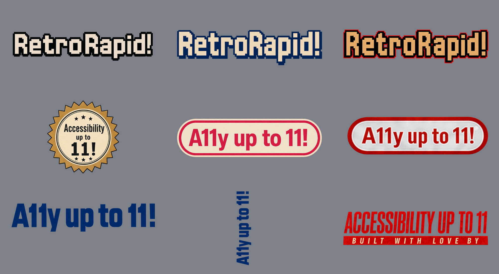

# RetroRapid! Period Brand Marks

Reusable transparent raster marks derived from the approved Retro Cartridge and Retro Game Box artwork. These are intentionally period-specific display assets for screenshots, campaign artwork, press material, social posts, and other RetroRapid! marketing—not replacements for the product name in normal body copy.

## Asset Catalog

| Asset | Use |
|---|---|
| [`retrorapid-title-cartridge.png`](retrorapid-title-cartridge.png) | Cream-and-black 8-bit title treatment from Retro Cartridge. |
| [`retrorapid-title-game-box-light.png`](retrorapid-title-game-box-light.png) | Cream-and-cobalt 8-bit title treatment from the light Retro Game Box. |
| [`retrorapid-title-game-box-dark.png`](retrorapid-title-game-box-dark.png) | Cardboard-cream, black, and red 8-bit title treatment from the dark Retro Game Box. |
| [`accessibility-up-to-11-seal.png`](accessibility-up-to-11-seal.png) | Canonical gold `Accessibility up to 11!` seal. This is a byte-for-byte copy of the app-icon master. |
| [`a11y-up-to-11-publisher-pill-light.png`](a11y-up-to-11-publisher-pill-light.png) | Cream-and-pink fictional publisher lozenge from the light Retro Game Box. |
| [`a11y-up-to-11-publisher-pill-dark.png`](a11y-up-to-11-publisher-pill-dark.png) | White-and-red fictional publisher pill derived from the dark Retro Game Box. |
| [`a11y-up-to-11-wordmark-cobalt-vertical.png`](a11y-up-to-11-wordmark-cobalt-vertical.png) | Original vertical cobalt `A11y up to 11!` identity-band wordmark. |
| [`a11y-up-to-11-wordmark-cobalt-horizontal.png`](a11y-up-to-11-wordmark-cobalt-horizontal.png) | Convenience horizontal orientation of the same cobalt wordmark. |
| [`accessibility-up-to-11-built-with-love-lockup.png`](accessibility-up-to-11-built-with-love-lockup.png) | Red `ACCESSIBILITY UP TO 11` / cream-on-red `BUILT WITH LOVE BY` publisher lockup. |

`brand-marks-preview.png` is an opaque catalog preview only. Every named mark above is an sRGB PNG with genuine transparency and transparent outer padding.

## Usage

- Preserve each asset's aspect ratio, spelling, internal spacing, texture, and full silhouette.
- Choose the treatment that belongs with the campaign's period and palette; do not recolor a multi-tone mark into another listed treatment.
- Crop transparent padding when layout requires it, but do not crop the visible mark.
- Keep `RetroRapid!` together, including its exclamation mark.
- Describe the pill and lozenge assets as fictional or period-inspired publisher marks. They are original RetroRapid! artwork and must not be presented as Nintendo branding, certification, affiliation, or endorsement.
- The cobalt horizontal file is a deterministic rotation of the vertical master. The seal is copied unchanged from [`Plans/assets/alternate-app-icon-concepts/accessibility-up-to-11-seal.png`](../../../Plans/assets/alternate-app-icon-concepts/accessibility-up-to-11-seal.png).

## Sources and Production

The approved edit targets were:

- [`retro-cartridge-v6.png`](../../../Plans/assets/alternate-app-icon-concepts/retro-cartridge-v6.png)
- [`retro-game-box-v8.png`](../../../Plans/assets/alternate-app-icon-concepts/retro-game-box-v8.png)
- [`retro-game-box-dark-v8.png`](../../../Plans/assets/alternate-app-icon-concepts/retro-game-box-dark-v8.png)

The title and publisher assets were produced with the built-in ImageGen background-extraction workflow. Each run used a tightly cropped approved mark as its only edit target. The shared prompt structure was:

> Use case: background-extraction. Asset type: reusable transparent marketing wordmark or fictional publisher mark. Isolate only the complete supplied mark and remove every surrounding icon or box-art pixel. Preserve the approved lettering, exact verbatim text, colors, stepped outlines, shadows, print texture, proportions, spacing, punctuation, and silhouette rather than redesigning or re-typesetting it. Keep the full mark centered with generous transparent padding. Produce a genuinely transparent background with clean edges and no halo. Do not add extra text, real publisher or platform branding, trademarks, mockups, borders, or watermarks.

The exact protected text was `RetroRapid!`, `A11y up to 11!`, or the two-line `ACCESSIBILITY UP TO 11` / `BUILT WITH LOVE BY`, as appropriate. The dark publisher-pill retry added these constraints:

> Perform background removal only. Preserve the small flat white/light-grey printed pill, thin red outline, restrained grey shadow, and compact proportions. Do not redraw, beautify, relight, thicken, or style it as glossy plastic; avoid a red outer casing, glow, gradient background, or altered punctuation.

The final files were mechanically trimmed, given transparent working padding, normalized to sRGB, and checked on a neutral contrasting background. One isolated non-mark registration speck was removed from the dark title extraction. An extra apostrophe-like extraction artifact after the dark pill's exclamation mark was removed with a tiny masked reconstruction from the adjacent printed-paper interior. The approved typography and connected outlines were otherwise left unchanged.
