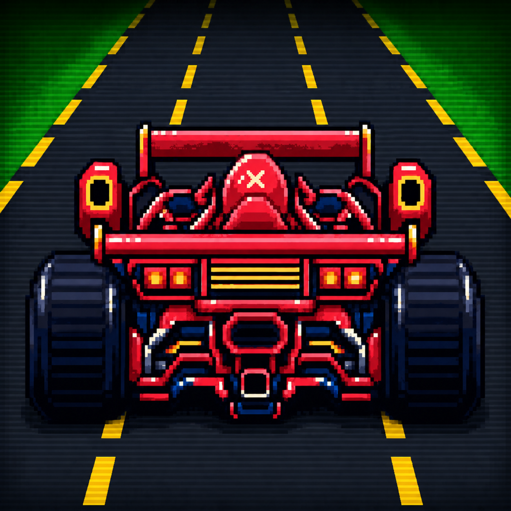
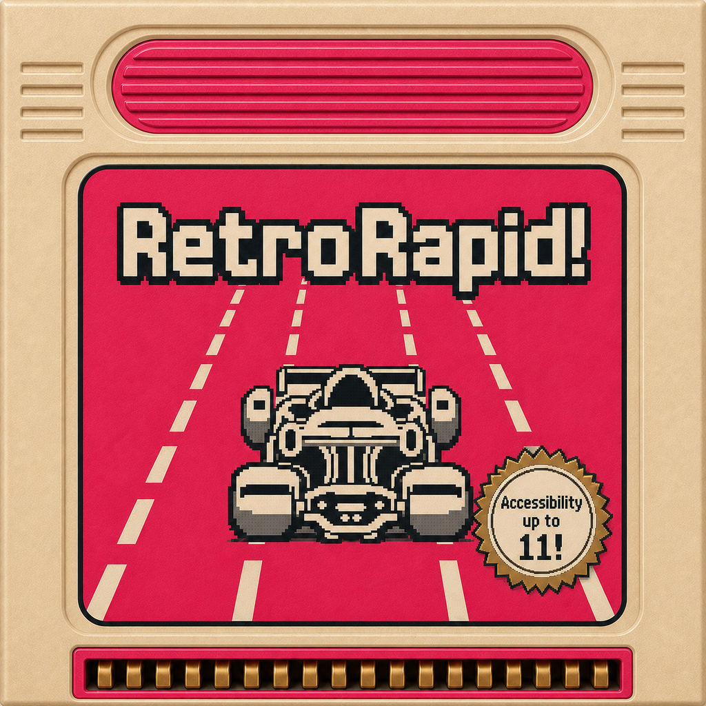
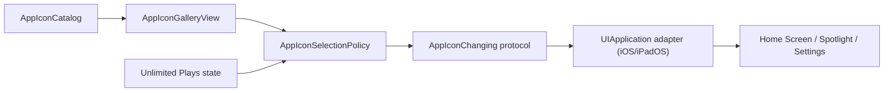

# Alternate App Icons Plan

**Status:** In progress — Pocket/LCD/Cartridge/CRT layered pilot and v4 Special Edition appearances implemented; remaining alternates and full appearance/device QA remain open
**Created:** 2026-08-12

**See also:** [Monetization](../Requirements/monetization.md) · [Theming](../Requirements/theming_system.md) · [Accessibility](../Requirements/accessibility.md) · [Localization](../Requirements/localization.md) · [Testing](../Requirements/testing.md)

## Goal

Let people with **Unlimited Plays** choose a RetroRapid! app icon without creating a second purchase or a new user-facing premium tier.

The feature should feel like a collectible cosmetic benefit while keeping the existing pink icon as **Classic**, the default icon. Icon selection is independent from gameplay Style selection: changing a Style must not silently change the Home Screen icon, and changing the icon must not change gameplay.

## Recommendation

- Ship the chooser first on iPhone and iPad, where Apple provides a persistent alternate-icon API and RetroRapid! is publicly available.
- Keep the current shipped artwork as the Classic primary icon and offer eight alternates: one for each gameplay theme (Pocket, LCD, Cartridge, CRT, Disc, and Polygon) plus two special icons (Retro Cartridge and Retro Video Game).
- Unlock alternate selection with the existing Unlimited Plays entitlement. The primary icon remains selectable by everyone.
- Let free users inspect the gallery. Selecting a locked alternate presents the existing Unlimited Plays paywall only after entitlement resolution; it never creates a separate purchase.
- Never auto-sync the icon with the selected gameplay Style. A system-level icon change should always follow a deliberate user tap.
- Do not automatically replace an already-selected alternate after an entitlement refund, debug revocation, or rollout-flag change. Lock further alternate changes but always allow returning to Classic; this avoids an unsolicited system icon-change alert on launch.
- Bundle every package in Debug and Release. Expose the gallery only behind `debugGameplay.alternateAppIconsEnabled`, which defaults on for fresh Debug installs, respects a stored Debug override, and is forcibly false outside Debug features.
- Treat the theme PNGs in this plan as art-direction concepts; production Pocket/LCD/Cartridge/CRT use exact curated theme car artwork. The approved v4 Special Edition PNGs are the runtime Default sources, and their approved v5 Dark companions are separately rendered charcoal-material sources with the same content and composition.

## Concept Set

All concept PNGs are unmasked, opaque `1024×1024` sources. The system, not the artwork, should apply the final icon mask. Shape validation uses the tracked mask extracted from the supplied iOS 27 Photoshop template, including its flatter top/side runs and early continuous-corner shoulder transition. Only the selected final concept for each catalog entry remains in the asset folder; superseded revisions are intentionally excluded.

The nine-icon catalog starts with Classic, then one icon for each of RetroRapid's six gameplay themes, followed by two special hardware icons. Theme icons share the actual game renderer's projected road grammar. Pocket retains its approved three-path interrupted-center composition while LCD uses four broad boundary paths. Each icon derives every path and both road edges from one shared vanishing point; boundaries run from the top through the lower edge, and marker width, length, and spacing increase toward the viewer. Each icon retains its theme's canonical road, marker, and exterior colors.

| Icon | Role | Concept | Production note |
|---|---|---|---|
| Classic | Primary; free |  | Keep the shipped pink appearance and stable `nil` API mapping. |
| Pocket | Theme alternate |  | Preserve the preferred four-tone LCD treatment and interrupted center marker, with olive road, darker olive marks, and pale yellow-green exterior. |
| LCD | Theme alternate |  | Keep this distinct from Classic: canonical monochrome LCD car, pastel-beige playfield, warm-grey markers, and four renderer-aligned paths. |
| Cartridge | Theme alternate |  | Preserve hard 8-bit edges, medium-grey road, bright-yellow markers, lighter-grey exterior, and the same four-path front/behind continuity as CRT. |
| CRT | Theme alternate |  | Preserve the approved grey/yellow/grass palette and four-path road perspective; reduce fine scanline detail only if it muddies at Settings size. |
| Disc | Theme alternate |  | Preserve the curated 32-Bit car, dark asphalt, four aqua marker paths, and subtle circuit texture confined to the deep-teal exterior. |
| Polygon | Theme alternate |  | Preserve the canonical low-poly silhouette, four exhausts, midnight road, four white marker paths, and restrained neon-aqua exterior accents. |
| Retro Cartridge | Special alternate |  | Copy v4 byte-for-byte into Default and the approved [`retro-cartridge-dark-v5.png`](assets/alternate-app-icon-concepts/retro-cartridge-dark-v5.png) into Dark. Both retain the label, vent, trim, seal, connector accents, and mask-concentric hardware composition; Dark uses genuinely rendered charcoal molding. |
| Retro Video Game | Special alternate |  | Copy v4 byte-for-byte into Default and the approved [`retro-video-game-dark-v5.png`](assets/alternate-app-icon-concepts/retro-video-game-dark-v5.png) into Dark. Both retain the LCD game, bezel, controls, slots, trim, and mask-concentric hardware composition; Dark uses genuinely rendered charcoal molding. |

Source sketches: [Retro Cartridge](assets/alternate-app-icon-concepts/sketch-tabletop-source.png) · [Retro Video Game](assets/alternate-app-icon-concepts/sketch-handheld-source.png)

Retro Video Game intentionally omits titles, button letters, scores, and other tiny text. Its monochrome beige LCD screen uses the exact shipped iPad LCD player and rival sprites rather than generated interpretations. Its four road boundaries share one gentle projected bend: dash centers follow their respective curves, dash faces stay tangent to them, and length, width, and spacing increase toward the viewer. Retro Cartridge is the deliberate exception: `RetroRapid!` and the original `Accessibility up to 11!` certification-style seal are printed-label art, not interface copy. The label keeps its title, car, seal, and border within the central mask-safe region, while the exposed connector uses one neat row of classic gold contacts. The period-inspired seal must not reproduce Nintendo's name, wordmark, wording, typography, or exact seal geometry. Both hardware designs are fictional and must not become replicas of Apple products or recognizable commercial consoles.

Generation provenance and the final prompt set are recorded in [the concept README](assets/alternate-app-icon-concepts/README.md).

## Platform Scope

| Platform | System capability | Plan |
|---|---|---|
| iPhone and iPad | `UIApplication` supports persistent alternate icons. | **v1.** Configure the gallery as eligible. Treat runtime support as an operation guard, not a visibility gate. |
| macOS | AppKit can temporarily change only the Dock tile image; it is not an equivalent persistent app-icon chooser. | Do not expose the feature. Keep visual and behavioral expectations consistent. |
| Apple Watch | The alternate-icon API is unavailable. | Do not expose the feature. |
| Apple TV | UIKit supports alternate icons, but tvOS requires separate rectangular parallax stacks and RetroRapid! is not publicly listed there. | Defer until a public tvOS plan justifies the asset and QA cost. |
| Apple Vision Pro | A compatible iPhone/iPad app can retain alternate-icon behavior, but Apple documents native visionOS SDK apps as unsupported. RetroRapid! has a native target. | Do not expose the feature in the native visionOS app. |

The shared UI is driven by injected platform eligibility so unsupported targets do not need platform checks in shared services or views. UIKit runtime capability remains separately observable for icon-change requests and diagnostics.

## User Experience

### Settings entry

- Add an **App Icon** disclosure row inside Theme, directly after the Style controls, on supported platforms.
- The row value is the current option name, such as **Classic**, **Pocket**, or **Retro Video Game**.
- Hide the entire row unless the injected service reports both iPhone/iPad platform eligibility and an enabled rollout flag. Do not hide it because UIKit temporarily reports no runtime support.
- Do not disable icon changes while a race is active; the setting is cosmetic and does not affect game state.

### Gallery

- Present a native grouped `List` that follows the Style Gallery's interaction and Unlimited Plays prompt patterns.
- Keep catalog and section order stable: Classic; Pocket, LCD, Cartridge, CRT, Disc, Polygon; Retro Cartridge, Retro Video Game.
- Mark the current icon with both a checkmark and a localized **Selected** value; never rely on color alone.
- For free users, show a lock on alternates and a concise Unlimited Plays benefit row. Tapping a locked alternate opens the existing voluntary paywall.
- While entitlement state is unresolved, show the gallery without an upsell and disable locked selections with a progress state. This avoids a paywall flash for returning purchasers.
- Selecting the already-active icon is a no-op.
- Selecting Classic passes `nil` to the system API and is always allowed.
- During a change, keep unrelated rows at full contrast and focusable, show a large activity indicator on the requested row, and reject repeated requests in the service.
- On success, update the checkmark from the system-reported current icon. Do not show a second custom success alert because the system already reports the change.
- Keep the full system-request lifecycle in the UIKit adapter. Trust matching reported state even when UIKit withholds or fails its callback, accept a successful system completion when state publication is delayed, and pause the bounded recovery budget while Apple's confirmation keeps the app inactive. The shared service owns observable progress and repeated-request suppression, then refreshes selection from reported system state.
- On failure, keep the previous selection and present a localized error alert.

### Entitlement behavior

| State | Classic | Alternates | Paywall behavior |
|---|---|---|---|
| Unlimited Plays | Selectable | Selectable | None |
| Resolved free user | Selectable | Previewable but locked | Locked tap opens voluntary paywall |
| Entitlement unresolved | Selectable | Previewable; temporarily disabled | No paywall until resolution |
| Entitlement revoked with alternate active | Selectable | Current alternate remains installed; other alternate changes locked | Locked tap opens paywall after resolution |

Use `hasPremiumAccessForGating` for returning-purchaser access and `shouldShowFreeTierAffordances` to decide when an upsell is appropriate.

## Technical Design

### Shared model and policy

Add platform-agnostic shared types:

- `AppIconID` — stable typed identifier for the nine catalog entries.
- `AppIconGroup` — stable Classic, Themes, and Special Editions grouping.
- `AppIconOption` — ID, localized name/description keys, group, preview asset name, and optional system icon name; `nil` identifies the Classic primary icon.
- `AppIconCatalog` — ordered, unique options with stable system names.
- `AppIconSelectionPolicy` — returns no-op, select, wait for entitlement, or present paywall.
- `AppIconChanging` — injected protocol exposing support, the system-reported current name, and an async change operation.

Suggested stable system names:

| Option | System icon name |
|---|---|
| Classic | `nil` |
| Pocket | `RetroRapidPocket` |
| LCD | `RetroRapidLCD` |
| Cartridge | `RetroRapidCartridge` |
| CRT | `RetroRapidCRT` |
| Disc | `RetroRapidDisc` |
| Polygon | `RetroRapidPolygon` |
| Retro Cartridge | `RetroRapidGameCartridge` |
| Retro Video Game | `RetroRapidVideoGame` |

Do not rename a shipped system icon name. The operating system owns the selected name, so stable names are compatibility data.

### Platform adapter

- Implement `UIApplicationAppIconChanger` in `RetroRacingUniversal`, not in the shared service layer.
- Map `supportsAlternateIcons`, `alternateIconName`, and the async `setAlternateIconName` API behind `AppIconChanging`.
- Keep the adapter main-actor isolated and surface typed errors to the shared gallery.
- Inject an explicit unsupported implementation from other composition roots. Do not create a business dependency by default inside a view initializer.
- Read the current icon from the system whenever the gallery appears. Do not persist a duplicate UserDefaults selection.



### Xcode and asset configuration

Apple's current Icon Composer workflow requires one `.icon` package for each alternate. The current six-package adaptive pilot is intentionally mixed:

1. Pocket, LCD, Cartridge, and CRT use layered Canvas, foreground Subject, and background World artwork. The Subject keeps the canonical car above the lane marks; the World keeps the road behind both. Pocket's three paths and LCD/Cartridge/CRT's four paths run through the full canvas and share their icon's true vanishing-point projection. Dark uses separate near-black off-road and road greys tinted subtly toward each Default palette, while lane marks retain each theme's characteristic light color. Each Road and Lane Marks layer uses Icon Composer's flat image-name specialization array to select Default, Dark, and Default-for-Tinted sources. Mono keeps the car at `1.0` opacity, lane marks at `0.75`, and road at `0.45`, producing the hierarchy used by Clear and Tinted. CRT adds a frontmost Accents group containing a separate full-canvas scanline and vignette SVG; its Dark source retains a stronger perimeter-only tube falloff, while its Mono opacity is `0.60`. Nested `slot` specializations are forbidden because Icon Composer silently ignores them.
2. Retro Cartridge and Retro Video Game keep the approved v4 PNG byte-for-byte as Default and use their approved v5 charcoal-material `Dark.png` companions through the same flat image-name specialization contract on one stable layer. Their document canvas explicitly specializes Default, Dark, and Tinted fills as well, matching Pocket/LCD so the compiled alternate carries an authored Dark canvas and Dark layer source together. The Dark companions retain the same screen or label content, accents, control hierarchy, and composition without requiring byte-identical pixels across appearances; Tinted and Clear are system generated.
3. Disc and Polygon remain flattened until the layered theme material and appearance recipe passes device QA. Classic remains unchanged.
4. Preserve the existing primary package name `RetroRapid.icon` and the Default appearance's shipped visual parity.
5. Add every alternate name to `ASSETCATALOG_COMPILER_ALTERNATE_APPICON_NAMES` for Debug and Release. Let Xcode generate `CFBundleIcons` entries; do not hand-maintain those generated keys in `Info.plist`.
6. Generate six `512×512` Default/Dark gallery preview pairs from the same package sources. The asset catalog follows the app color scheme while Xcode derives display-density renditions.
7. Run `./retrorapid assets app-icons` to regenerate sources and previews, `--dry-run` to inspect the plan, and `--check` to enforce deterministic drift without overwriting tracked Composer styling.

Author Default artwork plus Dark and Mono annotations, then let Icon Composer derive the six system presentations: Default, Dark, Clear Light/Dark, and Tinted Light/Dark. Every result must preserve the same core silhouette and remain recognizable. Keep the source artwork square and unmasked, but validate every concept through [`ios-27-icon-mask.png`](assets/alternate-app-icon-concepts/ios-27-icon-mask.png) so critical artwork stays in the central safe region and inset hardware contours remain concentric with the actual continuous-corner crop. Avoid pre-rounded layers, tiny text, excessive baked glow, and baked inter-layer shadows that conflict with system effects.

### Suggested file placement

- `RetroRacing/RetroRacingShared/AppIcon/` — IDs, catalog, selection policy.
- `RetroRacing/RetroRacingShared/Services/Protocols/AppIconChanging.swift` — protocol.
- `RetroRacing/RetroRacingShared/Views/AppIconGalleryView.swift` — shared gallery.
- `RetroRacing/RetroRacingUniversal/AppIcon/UIApplicationAppIconChanger.swift` — UIKit adapter.
- `RetroRacing/RetroRacingUniversal/Assets/RetroRapid*.icon` — compiled Icon Composer packages.
- `Icon/Alternates/` — editable/source exports if retained outside the target.

## Accessibility and Localization

- Give each option a localized name and a concise accessibility description of its visual style.
- Make each list row one accessibility element with its visual description, lock state, and selected state. Hide decorative preview pixels from VoiceOver.
- Preserve a logical reading order matching the visual catalog order.
- At accessibility Dynamic Type sizes, place the preview and state indicator above the wrapping name and cap the decorative preview at 180 points so the row remains navigable.
- Support VoiceOver, Voice Control, Switch Control, Full Keyboard Access, Increase Contrast, Differentiate Without Color, Reduce Transparency, and Reduce Motion.
- Do not encode selection or locked state through color alone.
- Add all new user-visible strings to `Localizable.xcstrings` and localize them across the supported locale catalog.
- Keep text out of the icon artwork so the same icon package works in every locale.

## Monetization and App Store Work

- Reuse `com.accessibilityUpTo11.RetroRacing.unlimitedPlays`; no new product or tier.
- Add alternate icons to the Unlimited Plays benefit copy only while both rollout and iPhone/iPad platform eligibility are enabled, without weakening the primary unlimited-rounds promise.
- No public listing or IAP copy changes ship while Release forces the feature off. When rollout becomes a production decision, update App Store review notes and any screenshots only through [AppStore/README.md](../AppStore/README.md).
- Avoid public claims for macOS, watchOS, tvOS, or native visionOS icon switching.
- All primary, alternate, dark, clear, and tinted icons ship in the binary and remain subject to App Review.

## Validation

### Automated

- Catalog order, uniqueness, stable system-name mapping, and `nil` Classic mapping.
- Selection-policy coverage for entitled, free, unresolved, revoked, current, and Classic cases.
- Debug-default-on flag behavior, stored Debug overrides, immediate UI reaction, and Release isolation from stored state.
- Gallery behavior with success, failure, unsupported service, and repeated taps using injected test doubles.
- Settings row visibility by injected platform eligibility and rollout state, independently from transient UIKit capability.
- Localization-key and asset-presence checks for every catalog entry.
- Existing package, documentation, asset audit, and platform suites remain green.

Recommended gate after implementation:

```bash
./retrorapid assets app-icons --check
./retrorapid test package
./retrorapid assets audit --check
./retrorapid assets audit --full --check
./retrorapid check
./retrorapid test --platform all
./retrorapid docs
```

### Manual iPhone and iPad

- Change from Classic to every alternate and back; verify the system confirmation, selected checkmark, and error recovery.
- Verify Home Screen, App Library, Spotlight, Settings, notifications, share sheets, and post-relaunch state.
- Verify persistence across an app update and expected reset behavior after reinstall.
- Review every icon at small system sizes and in Default, Dark, Clear, and Tinted appearances on light and dark wallpapers.
- Test free, entitled, cold-launch cached entitlement, restored purchase, debug revocation, and refund-like states.
- Run the accessibility matrix listed above with the largest supported text sizes.
- Compare archive size before and after the icon set; optimize source layers if the compiled increase is disproportionate.

## Implementation Record

- `Requirements/app_icons.md` is the shipped behavior contract and is routed from `Requirements/INDEX.md`.
- Shared catalog, selection policy, observable service, UIKit adapter, deterministic fakes, Theme-integrated Settings gallery, paywall gating, Debug flag, package declarations, previews, localization, and automated packaging checks are implemented.
- Release bundles all packages but the resolver forcibly hides the gallery and icon-specific paywall copy.
- Pocket, LCD, Cartridge, and CRT now use deterministic semantic SVG road/lane layers plus transparent canonical SpriteKit cars. Their tracked manifests preserve foreground-to-background ordering, full-height projected boundaries, flat Default/Dark/Tinted image source mappings, Mono (`tinted`) treatments, and no flattened `Default.png`. CRT additionally keeps its scanline/highlight pattern and vignette in a frontmost appearance-specialized Accents layer so the effect covers both the car and world.
- Retro Cartridge and Retro Video Game use the approved v4 PNGs unchanged for Default and approved v5 charcoal-plastic companion renders for Dark. A single layer selects them through the same appearance-aware source contract. This is a deliberate exception to semantic layering so each appearance retains intentional material depth.
- `./retrorapid assets app-icons` copies these canonical sources into the Special Edition packages and owns the generated Pocket/LCD/Cartridge/CRT layers plus all six adaptive Default/Dark gallery preview pairs. The runtime asset audit verifies package references, geometry, layer order, flat image/opacity appearance specializations, adaptive preview mappings, and output drift, while `./retrorapid check` includes the generator's `--check` gate.
- Disc and Polygon remain flattened. Physical-device icon changes and return-to-Classic behavior are verified; residual work is hands-on six-presentation QA for this pilot, layered conversion of the remaining alternates, and the full device/accessibility matrix. tvOS remains deferred.

## Effort Estimate

| Work | Estimate |
|---|---:|
| Rebuild and refine the selected nine-icon catalog | 0.5–1 day |
| Complete remaining two theme alternates as layered Icon Composer packages | 1–2 days |
| Shared catalog, policy, gallery, UIKit adapter, and composition-root wiring | 1.5–2 days |
| Unit/UI tests, localization, requirements, and paywall/App Store updates | 1–2 days |
| Appearance, device, entitlement, accessibility, and archive-size QA | 1–2 days |
| **Total** | **6–11 person-days** |

The code cost changes little with icon count; layered art production and appearance QA are the main variable costs. The selected v1 catalog keeps all six theme identities plus both special hardware icons, accepting that art and appearance QA cost in exchange for a coherent collectible gallery.

## Deferred Product Decision

- Should a future public tvOS release receive its own rectangular parallax interpretations, or keep this benefit specific to iPhone and iPad?

## Apple References

- [Configuring your app to use alternate app icons](https://developer.apple.com/documentation/xcode/configuring-your-app-to-use-alternate-app-icons)
- [`setAlternateIconName`](https://developer.apple.com/documentation/uikit/uiapplication/setalternateiconname%28_%3Acompletionhandler%3A%29)
- [Creating your app icon using Icon Composer](https://developer.apple.com/documentation/xcode/creating-your-app-icon-using-icon-composer)
- [Human Interface Guidelines: App icons](https://developer.apple.com/design/human-interface-guidelines/app-icons/)
