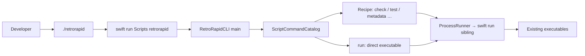

# Retrorapid Developer CLI

**Status:** Done (2026-07-23)  
**Created:** 2026-07-23

## Problem

Today every workflow is invoked as a long, easy-to-forget command:

```bash
swift run --package-path Scripts apply-game-center-eu-localizations --dry-run
```

There are **12 executables** in [`Scripts/Package.swift`](../Scripts/Package.swift), plus composite “recipes” documented in [`Scripts/README.md`](../Scripts/README.md). Nothing ties them together for discovery, grouping, or consistent help.

## Recommended approach

Add a **thin dispatcher** — not a refactor of existing `main.swift` files. The new CLI:

1. Maintains a **single catalog** of scripts + recipes (testable, documented once).
2. Resolves the repo root via existing [`RepositoryLocator`](../Scripts/Sources/ScriptSupport/RepositoryLocator.swift).
3. Delegates to sibling executables using [`ProcessRunner`](../Scripts/Sources/ScriptSupport/ProcessRunner.swift) + `swift run --package-path <repo>/Scripts <executable> …`.
4. Keeps all business logic in existing library targets (`*Core`, per [`Scripts/CONVENTIONS.md`](../Scripts/CONVENTIONS.md)).



**Why subprocess delegation (v1):** zero duplication of workflow code, existing `--dry-run` / `--check` flags stay authoritative, and each tool remains runnable independently for agents/CI.

## CLI surface (v1)

Primary entry: `./retrorapid` at repo root (forwards to Swift executable).

| Command | Maps to | Notes |
|---|---|---|
| `./retrorapid` | help | Usage + top-level groups |
| `./retrorapid list` | — | All executables + recipes with one-line purpose (from README table) |
| `./retrorapid check` | recipe | Runs README “verify generated content” set |
| `./retrorapid test` | `run-tests` | Pass-through args |
| `./retrorapid test package` | `swift test --package-path Scripts` | Scripts unit tests |
| `./retrorapid docs` | `check-documentation` | |
| `./retrorapid metadata generate` | `generate-metadata-docs` | Supports `--check` |
| `./retrorapid metadata apply` | `apply-retrorapid-metadata` | Supports `--dry-run`, existing flags |
| `./retrorapid asc iap` | `apply-iap-localizations` | Supports `--asc-api`, `--dry-run` |
| `./retrorapid asc game-center` | `apply-game-center-eu-localizations` | Supports scope + `--dry-run` |
| `./retrorapid asc game-center print` | `print-game-center-eu-localizations` | Read-only manual fallback |
| `./retrorapid screenshots capture` | `capture-app-store-screenshots` | Pass-through flags |
| `./retrorapid screenshots sync` | `sync-screenshot-studio-localizations` | Pass-through flags |
| `./retrorapid assets masks` | `generate-road-dash-masks` | Pass-through flags |
| `./retrorapid testflight` | `submit-testflight-build` | Forwards subcommand + flags |
| `./retrorapid run <executable> [args…]` | any cataloged executable | Escape hatch |

**Decisions locked in:**

- CLI name: `retrorapid`
- Repo-root wrapper: tracked `./retrorapid` bash script forwarding to `swift run`

## Implementation todos

- [x] Add `ScriptCommandCatalog` + `ScriptCommandRunner` in `ScriptSupport`
- [x] Add `RetroRapidCLI` executable with subcommand parsing
- [x] Add tracked repo-root `./retrorapid` bash script
- [x] Add `ScriptCommandCatalogTests`
- [x] Update `Scripts/README.md`, `Scripts/CONVENTIONS.md`, and `AGENTS.md`

## v2 — Interactive menu (2026-07-25)

- [x] `./retrorapid` with no args opens an interactive menu on TTY (`RetroRapidInteractiveMenu`)
- [x] `./retrorapid menu` alias
- [x] `./retrorapid check` includes IAP + Game Center catalog validation
- [x] Per-command `--help` on delegated executables; subcommand help forwarding fixed

## Out of scope (v1)

- Global install / `~/bin` symlink packaging
- Replacing individual executables
- Interactive TUI or credential prompts *(v2 adds a lightweight numbered menu on TTY only)*
- Parallel recipe execution
- Auto-generating catalog from `Package.swift`

## Residual risks

- **Cold-start latency:** each delegated command pays `swift run` startup cost.
- **Catalog drift:** mitigated by a test asserting catalog entries match `Package.swift` executable products.
