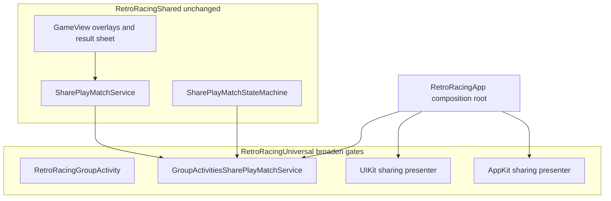

# SharePlay on macOS Plan

**Status:** Planned.

**See also:** [`Requirements/shareplay_multiplayer.md`](../Requirements/shareplay_multiplayer.md) (shipped iOS/iPad v1 behavior) · [`shareplay_competitive_mode_plan.md`](shareplay_competitive_mode_plan.md) (original iOS+iPad planning record)

## Summary

Enable RetroRapid's existing SharePlay competitive mode on macOS by reusing the platform-agnostic shared layer and broadening the `RetroRacingUniversal` GroupActivities adapter, with a new AppKit sharing presenter and composition-root wiring that today is iOS-only.

Rollout timing (same release vs follow-up) and App Store copy are out of scope for this plan; defer ASO updates until that decision is made ([`aso/10-shareplay-release-campaign.md`](aso/10-shareplay-release-campaign.md) currently says not to claim macOS SharePlay).

## Current state

SharePlay v1 is fully implemented for **iPhone/iPad** inside `RetroRacingUniversal`. The shared game layer (`RetroRacingShared/SharePlay/*`, `GameViewModel+SharePlay`, overlays, result UI) is already platform-agnostic.

macOS is excluded at the **composition/adapter layer only**:

```202:208:RetroRacing/RetroRacingUniversal/App/RetroRacingApp.swift
        #if os(iOS)
        sharePlayMatchService = GroupActivitiesSharePlayMatchService(...)
        #else
        sharePlayMatchService = NoOpSharePlayMatchService()
        #endif
```

The macOS menu branch also omits the entry point and sharing presenter:

```390:413:RetroRacing/RetroRacingUniversal/App/RetroRacingApp.swift
        #if os(macOS)
        return MenuView(..., onPlayRequest: ..., onSettingsRequest: ...)
        // no onPlayWithFriendsRequest, no SharePlayActivitySharingPresenter
```

All GroupActivities adapter files are compiled out on macOS via `#if canImport(GroupActivities) && os(iOS)`:

- [`RetroRacing/RetroRacingUniversal/SharePlay/RetroRacingGroupActivity.swift`](../RetroRacing/RetroRacingUniversal/SharePlay/RetroRacingGroupActivity.swift)
- [`RetroRacing/RetroRacingUniversal/SharePlay/GroupSessionCoordinator.swift`](../RetroRacing/RetroRacingUniversal/SharePlay/GroupSessionCoordinator.swift)
- [`RetroRacing/RetroRacingUniversal/SharePlay/GroupSessionMessengerTransport.swift`](../RetroRacing/RetroRacingUniversal/SharePlay/GroupSessionMessengerTransport.swift)
- [`RetroRacing/RetroRacingUniversal/SharePlay/GroupActivitiesSharePlayMatchService.swift`](../RetroRacing/RetroRacingUniversal/SharePlay/GroupActivitiesSharePlayMatchService.swift)
- [`RetroRacing/RetroRacingUniversal/SharePlay/SharePlayActivitySharingPresenter.swift`](../RetroRacing/RetroRacingUniversal/SharePlay/SharePlayActivitySharingPresenter.swift)

**Good news:** [`RetroRacing/RetroRacingUniversal/RetroRacingUniversal.entitlements`](../RetroRacing/RetroRacingUniversal/RetroRacingUniversal.entitlements) already includes `com.apple.developer.group-session`. Apple's `GroupActivitySharingController` and `GroupStateObserver` are available on native macOS, so no new capability is expected—only compile gates and a macOS presenter.

## Target behavior

Parity with iOS/iPad v1 on macOS:

- **Play with Friends** in the menu (never paywalled; same free-play exception)
- Host flow: `GroupStateObserver.isEligibleForGroupSession` → direct `activate()`, else system sharing UI
- Guest flow: incoming session via `observeIncomingSessions()`
- Same match lifecycle, HUD, overlays, result sheet, retry handshake, guest speed restore
- Cross-platform sessions using the existing activity identifier (`com.accessibilityUpTo11.RetroRacing.shareplay.competitive`)

**Out of scope:** tvOS, watchOS, visionOS (remain on `NoOpSharePlayMatchService`).



## Implementation plan

### 1. Introduce a single compile gate for SharePlay-capable platforms

Add a small shared compile helper in the Universal target (e.g. `SharePlayPlatformSupport.swift`):

```swift
#if canImport(GroupActivities) && (os(iOS) || os(macOS))
enum SharePlayPlatformSupport {
    static let isEnabled = true
}
#endif
```

Replace repeated `#if canImport(GroupActivities) && os(iOS)` across adapter files and [`RetroRacingApp.swift`](../RetroRacing/RetroRacingUniversal/App/RetroRacingApp.swift) with this condition. Keeps gates consistent and documents intent.

### 2. Broaden the GroupActivities adapter (no logic changes expected)

Update the `#if` wrapper on these files from `os(iOS)` → `os(iOS) || os(macOS)`:

- `RetroRacingGroupActivity.swift`
- `GroupSessionCoordinator.swift`
- `GroupSessionMessengerTransport.swift`
- `GroupActivitiesSharePlayMatchService.swift`

Review comments that say "iOS/iPad only" and update to "iOS/iPad/macOS". **Do not** add `#if os()` inside `RetroRacingShared` services (per [`Requirements/shareplay_multiplayer.md`](../Requirements/shareplay_multiplayer.md)).

The coordinator, messenger, state machine, and service actor should compile unchanged—the GroupActivities APIs used are cross-platform.

### 3. Add a macOS sharing presenter (main new code)

[`SharePlayActivitySharingPresenter.swift`](../RetroRacing/RetroRacingUniversal/SharePlay/SharePlayActivitySharingPresenter.swift) today is UIKit-only. Add a parallel **AppKit** implementation for macOS, mirroring the existing host-controller pattern:

- Keep `SharePlaySharingPresentation` platform-neutral (already is).
- iOS: existing `UIViewControllerRepresentable` + `SharePlayActivitySharingHostController`.
- macOS: new `NSViewControllerRepresentable` + host that:
  - Presents `GroupActivitySharingController(RetroRacingGroupActivity())` modally from a window-backed host
  - Observes `controller.result` (`.success` vs `.cancelled`) with the same semantics as iOS
  - Calls `onUserDismissed` only on user cancellation, not on successful session start
  - Handles re-present after dismiss (fresh `SharePlaySharingPresentation.id`)

Follow the existing invisible-host precedent in [`OfferCodeRedemptionHostView.swift`](../RetroRacing/RetroRacingShared/Views/OfferCodeRedemptionHostView.swift) and the Game Center `AuthContainerViewController` pattern referenced in the iOS presenter.

Expose one SwiftUI type to the app (either a thin wrapper struct or `#if os(macOS)` typealias) so `RetroRacingApp` stays readable.

### 4. Wire SharePlay in the composition root

Changes in [`RetroRacingApp.swift`](../RetroRacing/RetroRacingUniversal/App/RetroRacingApp.swift):

| Area | Change |
|---|---|
| Service construction | Use `GroupActivitiesSharePlayMatchService` when SharePlay gate is true (iOS **or** macOS); `NoOpSharePlayMatchService` only for tvOS/watchOS/visionOS |
| `GroupStateObserver` | Instantiate on macOS too (same eligibility check as iOS) |
| `handlePlayWithFriendsRequest()` | Use the full iOS branch (eligible → `startHostSession()`, else → `prepareHostActivation()` + sharing presenter) on macOS |
| `menuView` | **Consolidate** the duplicated macOS vs iOS `MenuView` builders: pass `onPlayWithFriendsRequest`, `isSharePlayActive`, and attach the sharing presenter `.background` on both platforms |
| Sharing presenter placement | Attach to macOS menu overlay the same way as iOS (hidden host in menu background while `sharePlaySharingPresentation != nil`) |
| macOS settings sheet | Keep difficulty lock accurate during SharePlay: prefer `sharePlayUIState.state.isActive \|\| (shouldStartGame && !isMenuPresented)` in `settingsSheetView` for explicit parity with menu-embedded settings |

No changes expected to the long-lived `.task` that calls `setStateChangeHandler` and `observeIncomingSessions()`—it already runs on all Universal platforms.

### 5. Update fallback service documentation

[`NoOpSharePlayMatchService.swift`](../RetroRacing/RetroRacingShared/Services/Implementations/NoOpSharePlayMatchService.swift): update the header comment from "macOS, tvOS, …" to "tvOS, watchOS, visionOS, tests, previews".

### 6. Shared UI — verify, minimal touch-ups only

Most SharePlay UI already works on macOS:

- [`SharePlayOverlayCardStyle.swift`](../RetroRacing/RetroRacingShared/Views/SharePlayOverlayCardStyle.swift) — macOS uses the `#else` material branch (no `glassEffect` needed)
- [`SharePlayResultView.swift`](../RetroRacing/RetroRacingShared/Views/SharePlayResultView.swift) — macOS shows inline action buttons via `usesBottomActionBar == false`

Spot-check during manual QA: overlay centering on macOS window sizing, result `.sheet` presentation, keyboard/game-controller input during SharePlay pause lock.

### 7. Requirements and routing docs

Update shipped-behavior contracts (required per `AGENTS.md`):

- [`Requirements/shareplay_multiplayer.md`](../Requirements/shareplay_multiplayer.md) — v1 scope → iOS/iPad/**macOS**; architecture diagram adapter label; manual QA matrix adds macOS scenarios
- [`Requirements/INDEX.md`](../Requirements/INDEX.md) — scope line
- [`Requirements/launch_flow.md`](../Requirements/launch_flow.md) — Play with Friends available on macOS menu overlay
- [`Requirements/monetization.md`](../Requirements/monetization.md) — confirm free-play exception applies on macOS (behavior unchanged; wording only if platform-specific)
- [`Requirements/testing.md`](../Requirements/testing.md) — note macOS manual QA requirement

## Testing plan

### Automated (unchanged + run on macOS scheme)

Existing shared tests should remain sufficient—no state-machine changes:

```bash
swift test --package-path Scripts
swift run --package-path Scripts run-tests
```

Key suites: `SharePlayMatchStateMachineTests`, `SharePlayTwoPeerConvergenceTests`, `SharePlayGuestSpeedRestoreTests`, SharePlay cases in `GameViewModelTests`.

### Manual QA (required before shipping macOS SharePlay)

Run the checklist from [`Requirements/shareplay_multiplayer.md`](../Requirements/shareplay_multiplayer.md) on macOS, plus cross-platform matrix:

| Scenario | Devices |
|---|---|
| macOS host → macOS guest | 2 Macs |
| macOS host → iPad/iPhone guest | Mac + iOS device |
| iOS host → macOS guest | iPhone/iPad + Mac |
| Not in FaceTime → sharing controller invite flow | macOS |
| Cancel invite → re-tap Play with Friends | macOS |
| Cmd+, settings during active SharePlay match | macOS (difficulty locked) |
| Menu/close exit mid-match | macOS |

Capture paired `SHAREPLAY_*` logs from both devices for any join/disconnect glitches (same diagnostics as iOS).

## Risks and mitigations

| Risk | Mitigation |
|---|---|
| `GroupActivitySharingController` presentation quirks on macOS (window/host timing) | Reuse invisible host + `viewDidAppear` gating from iOS; test re-present after cancel |
| macOS menu is a `ZStack` overlay, not `fullScreenCover` | Ensure sharing host has a valid window before presenting; verify no blank overlay after dismiss |
| Cross-platform countdown sync | Same activity ID and existing host-authoritative timestamp—validate mac↔iOS manually |
| Entitlement/provisioning drift | Entitlement already present; confirm macOS provisioning profile includes Group Activities after gate change |

## Suggested PR structure

1. **Adapter + compile gates** — broaden `#if`, add macOS sharing presenter, no app wiring yet (macOS still no-op until step 2)
2. **Composition root wiring** — service injection, menu consolidation, settings lock
3. **Docs** — requirements updates only

This keeps review focused and allows building the macOS target after step 1 to catch compile issues early.

## Checklist

- [ ] Add `SharePlayPlatformSupport` helper and broaden GroupActivities adapter `#if` gates to include macOS
- [ ] Implement AppKit `SharePlayActivitySharingPresenter` mirroring iOS host-controller semantics
- [ ] Wire `GroupActivitiesSharePlayMatchService`, `GroupStateObserver`, menu Play with Friends, and sharing presenter in `RetroRacingApp` for macOS
- [ ] Consolidate duplicated macOS/iOS `MenuView` builders and fix macOS settings difficulty lock during SharePlay
- [ ] Update `Requirements/shareplay_multiplayer.md` and routed INDEX/launch_flow/testing/monetization docs
- [ ] Run Scripts tests plus manual 2-device QA matrix (mac-mac, mac-iOS, iOS-mac)
