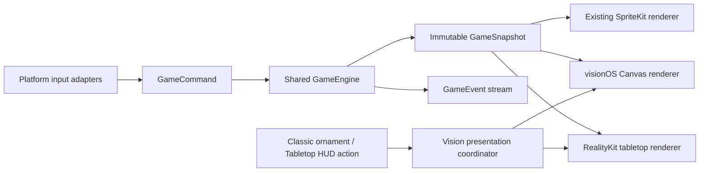

# visionOS Spatial Game and Polygon Theme Plan

**Status:** Automated candidate gate passed — physical-device candidate approval pending

**See also:** [Requirements index](../Requirements/INDEX.md) · [Theming](../Requirements/theming_system.md) · [Launch flow](../Requirements/launch_flow.md) · [Input handling](../Requirements/input_handling.md) · [Accessibility](../Requirements/accessibility.md)

## Goal

Replace the public visionOS placeholder with a native RetroRapid! game that offers two presentations of one continuous run:

- **Classic:** the regular window-based game, aligned with iPadOS and macOS.
- **Tabletop:** a genuine 3D board in a volumetric window.
- **Polygon:** an original late-1990s low-poly console aesthetic shared by both presentations.

The Polygon style is the free visionOS default. It also becomes a regular selectable theme on iPhone, iPad, macOS, watchOS, and tvOS for users with Unlimited Plays.

## Product Decisions

- The user-facing style name is **Polygon**. “N64-style” is an internal art-direction shorthand only; user-facing copy, asset names, and artwork must not use Nintendo branding, hardware likenesses, characters, logos, or other protected visual identity. Internal identifiers and the generated asset family retain `64Bit` for compatibility.
- Polygon is distinct from the Disc tvOS experiment. tvOS always includes/defaults to Disc, while visionOS always includes/defaults to Polygon; neither platform shows a Debug toggle for its required default. Other platforms expose the two styles through local Debug enablement while production access remains planned.
- visionOS starts in Classic presentation with Polygon selected. Debug builds may add Disc to Classic for renderer QA, but Tabletop remains Polygon-only because other themes do not have equivalent spatial assets.
- The 2D and 3D presentations are renderers of the same game session. Switching presentation never restarts the run, changes traffic, resets score/lives, or consumes a play.
- The Classic presentation toggle is a top ornament modeled after Xarra's Focus Mode control: **Play in 3D**. Tabletop places **Return to 2D** in its larger native top panel so status and presentation controls share one stable, guaranteed-visible surface above the volume.
- Tabletop uses RealityKit in a volumetric SwiftUI window. SceneKit is not a runtime dependency: Apple deprecates it and limits SceneKit content on visionOS to 2D presentation. See [SceneKit](https://developer.apple.com/documentation/scenekit/) and [volumetric windows](https://developer.apple.com/documentation/visionOS/creating-a-volumetric-window-in-visionos).
- RealityKit physics may animate cosmetic debris, but shared game logic remains authoritative for lanes, traffic, collisions, score, lives, timing, pause, and restart.
- SharePlay is out of scope for the first spatial release. visionOS continues to use the no-op SharePlay service until a separate multiplayer plan covers window and tabletop behavior.

## Theme Access Policy

| Platform | Polygon access | Default |
|---|---|---|
| visionOS | Free | Yes |
| iPhone | Unlimited Plays | No |
| iPad | Unlimited Plays | No |
| macOS | Unlimited Plays | No |
| tvOS | Unlimited Plays | No |
| watchOS | Unlimited Plays | No |

- Add `ThemeID.sixtyFourBit` with the persisted raw value `64bit` and a shared `SixtyFourBitTheme`.
- Append Polygon after the existing production theme catalog. If Disc remains debug-flagged, keep its experimental ordering independent of the production Polygon entry.
- Add a visionOS platform configuration whose default and only v1 theme is free Polygon.
- Non-vision platforms include Polygon in the Style Gallery as a premium theme and use the existing Unlimited Plays entitlement; do not introduce a separate purchase or “premium tier” label.
- watchOS must observe the same entitlement before exposing Polygon. This requires replacing its current hardcoded no-premium composition; existing Pocket/LCD/Cartridge/CRT access remains unchanged.
- Persisted Polygon selection follows the existing revocation/restoration contract: show the platform's free default while access is unavailable, then restore Polygon when Unlimited Plays returns.

## Experience Contract

### Classic window

- Use the established menu, Settings, HUD, pause, help, game-over, Game Center, play-limit, audio, and accessibility flows where those services are supported on visionOS.
- Render gameplay with a visionOS-native SwiftUI `Canvas` renderer driven by shared game snapshots. Generated Polygon sprites from the `64Bit` asset family supply the cars, helmets, and crash artwork.
- Keep layout close to iPadOS/macOS rather than introducing an immersive shell. The game board remains square and resizes with the standard window.
- Use gaze-and-pinch-friendly left/right controls and support keyboard or physical-controller input through existing adapters when available.

### Tabletop volume

- Present the road as a 0.90 m square tabletop diorama inside a 1.04 × 0.65 × 1.04 m volume. A centered five-row by three-lane grid uses 0.17 m square cells, symmetric side verges, straight flush-plane lane dividers, no visible horizontal seams, and snapshot-positioned safety markers.
- Normalize each car once inside an exact grid anchor from measured local model bounds, fitting it to no more than 58% of cell width and 64% of cell depth. Keep one player anchor, fifteen rival anchors, two safety markers, and one procedural low-poly impact burst pooled for the scene lifetime.
- Mount a high-contrast native SwiftUI top panel above the volumetric content instead of rendering it as a RealityKit attachment. It always shows score, lives, and level as visible localized text; it owns Pause/Resume and Return to 2D during play, and Game Over, Restart, Finish, and Return to 2D after the run.
- Use `RealityView`, `InputTargetComponent`, `CollisionComponent`, targeted spatial gestures, and hover effects for interactive entities.
- Each full road lane is the visible gaze-and-pinch movement target. Lane changes remain discrete commands; visible Left/Right buttons, directly dragging the car, free camera movement, full immersion, and room-scale gameplay are out of scope for v1.
- Keep world scale and depth comfortable when the volume opens. The player can reposition the system-managed volume without changing gameplay coordinates.
- Pause gameplay while the presentation coordinator transfers ownership between scenes. Resume only after the destination is ready and only if the user was not already explicitly paused.

### Presentation handoff

- The app composition root owns one `VisionGameSessionCoordinator` shared by the Classic and Tabletop scene declarations.
- The coordinator prevents duplicate volumes and serializes transition requests.
- Prefer `pushWindow` if standard-to-volumetric restoration is reliable on the release SDK. Encapsulate the API so `openWindow` plus `dismissWindow` can be used if cross-style push behavior fails validation.
- If opening the destination fails, keep the source presentation and session active and announce the failure accessibly.
- Dismissing Tabletop through window chrome restores Classic without losing the run.
- Returning to Classic is also available at game over and preserves the complete snapshot and session identity.

## Shared Gameplay Architecture

`GameEngine` now owns the renderer-independent solo simulation, and `GameScene` adapts its snapshots back into the existing SpriteKit renderer. The remaining plan extends the vertical slice to release parity and the complete Polygon theme.

## Implementation Checkpoint

- Completed: shared commands, snapshots, events, deterministic timing/traffic, collisions, pause locks, and SpriteKit adapter.
- Completed: Play flow, Classic Canvas, square RealityKit tabletop, native-top-panel handoff, session continuity, distinct player/rival 3D sources, model-derived rival sprites, and focused tests.
- Completed: single main-actor engine authority, tokenized window handoff, semantic lane input, bounded Direct Touch, localized recovery, deterministic asset tooling, and platform-aware test automation.
- Completed: shared Polygon identity/palette, complete five-sprite cross-platform runtime family, and Debug catalog enablement on non-vision platforms. Production Unlimited Plays exposure and watchOS entitlement wiring remain in Milestone 5.
- Completed: automated release gate and signed visionOS Release archive.
- In progress: physical Apple Vision Pro validation.
- Candidate decision: keep public **Coming Soon** status after this pass. Physical Apple Vision Pro QA first validates `pushWindow`; select the injected explicit open-before-dismiss strategy only if any restoration case fails, then repeat the full device matrix.
- Deferred beyond this gate: complete menu/service parity, audio/haptics, full model family, cross-platform premium theme access, public metadata/screenshots, and launch approval.

## Production-Hardening Evidence

As of 6 August 2026:

- The engine is the only gameplay authority. Collision recovery is tick-driven, pause reasons stack independently, and SpriteKit/Canvas/RealityKit consume immutable snapshots.
- Classic and Tabletop use unique `Window` scenes and a tokenized coordinator. The `.push` candidate and operational `.explicit` fallback are injected and covered by tests.
- Tabletop readiness waits for the canonical models, square board, fixed car/effect pools, lane targets, native top panel, and gesture installation. Typed load/routing/timeout failures recover Classic without fallback geometry.
- All 29 visionOS strings and recovery messages live in the shared catalog across the 20 runtime locales.
- The canonical spatial manifest generates a 27,594-byte player USDZ and a 27,033-byte rival USDZ, copies the established fixed-camera player source, and software-renders the 13,560-byte rival projection from its composed 3D source under the 25 KB sprite budget. Validation reports 1,264 player and 1,224 rival triangles and checks hierarchy, forbidden identity meshes, materials, bounds, target membership, source exclusion, RealityKit import, budgets, and output drift.
- `./retrorapid test --platform all` passes shared, Universal iOS, and visionOS suites. Destination resolution prefers compatible booted simulators, ignores stale unavailable device records, and otherwise selects the newest installed compatible runtime.
- The completed automated gate is `./retrorapid test package`, `./retrorapid check`, `./retrorapid test --platform all`, `./retrorapid assets spatial --check`, `./retrorapid assets audit --full --check`, and `./retrorapid docs`. The final runs include 43 ScriptSupport tests, 45 metadata tests, 104 automation-core tests, 692 shared app tests, 20 Universal tests, and 21 visionOS tests, all without failures or XCTest runtime warnings.
- Large `assetutil` reports exposed a pipe-buffer deadlock in captured subprocess output. `ProcessRunner` now uses automatically removed temporary files for stdout/stderr, with a regression test that captures 100,000 lines; both the normal and full asset gates complete on the expanded catalog.
- The full audit reports release packages of 61,768,455 bytes for iOS, 24,758,282 for watchOS, 35,295,464 for macOS, 13,550,225 for tvOS, and 11,630,306 for visionOS.
- The final visionOS Release archive completed successfully from the gated sources. The arm64 app is signed by `Apple Development: Daniel Devesa Derksen-Staats (2QKC3RQP2M)` for team `PV9S9FTZF2`, with bundle identifier `com.accessibilityUpTo11.RetroRacing-for-visionOS` and version `1.4.1 (26)`.

Physical device evidence is deliberately not inferred from simulator results. Scale, comfort, assistive technologies, repeated window restoration, ten-minute performance/memory behavior, and final `.push` selection remain unapproved until the required Apple Vision Pro matrix is recorded.

## Decision Log

- **6 August 2026 — public status:** retain **Coming Soon** after the hardening pass; no App Store availability, screenshots, or service-parity promise is implied.
- **6 August 2026 — art source:** promote the checked-in player USDA, dedicated rival USDA composition, and `spatial-production.json` camera/source/budget configuration as the candidate sources. The rival reuses the boxed base topology, bakes the teal palette, removes the helmet mark and player lamps, activates twin two-lamp vertical stacks, and retains four exhaust tubes. Tabletop loads the dedicated rival USDZ directly; the Classic rival and all platform renditions are rendered from that model. Runtime recoloring, ImageGen rival art, hue shifting, and fallback geometry are prohibited.
- **6 August 2026 — routing candidate:** test `.push` first because it restores the pushed Classic window naturally. `.explicit` remains selectable without code changes and must replace it if any physical-device lifecycle/restoration case fails.
- **6 August 2026 — automated candidate gate:** accept the simulator, deterministic-asset, package-size, documentation, Debug-build, and signed-archive evidence. Do not call the candidate device-validated or production-ready until the physical matrix below is complete.

- Extract a deterministic `GameEngine` into `RetroRacingShared/Game/Engine/`.
- The engine owns grid advancement, traffic generation, lane changes, speed/difficulty, collisions, score, lives, round state, pause locks, and restart/finish commands.
- Inject time/tick scheduling and randomness through protocols. Do not use renderer timing, RealityKit physics, or platform conditionals as game state.
- Publish immutable, `Sendable` `GameSnapshot` values and explicit `GameEvent` values for audio, haptics, achievements, and visual effects.
- Keep the engine actor/isolation boundary explicit. SwiftUI and renderer-facing state updates occur on the main actor; deterministic engine logic remains testable without a scene.
- Adapt the existing `GameScene` to consume snapshots so iOS, iPadOS, macOS, watchOS, and tvOS behavior does not fork or regress.
- Make Classic Canvas and Tabletop RealityKit renderers replaceable dependencies of the visionOS presentation layer.

## Polygon Art Direction

- Original chunky, low-polygon silhouettes with readable rear views at game scale.
- Small textures, restrained vertex colors, nearest-neighbor sampling where appropriate, simple baked lighting, shallow distance fog, and deliberately limited material detail.
- A player-red body and light helmet `X` preserve player identity. Rivals use the established cyan family, remain unmarked, and retain the recurring paired vertical lights and four-exhaust rear architecture.
- Keep strong value separation between car, road, lane markers, exterior terrain, and HUD in color, grayscale, and Increase Contrast modes.
- Avoid visual references that reproduce a specific commercial game, console shell, controller, logo, track, or character.

### Required canonical models

- Player car with marked driver helmet and separated wheels.
- Rival car with unmarked driver and exactly four exhaust pipes.
- Crash/debris set with one readable detached wheel.
- Player life helmet and unmarked friend/rival helmet.
- Modular road/tabletop base, lane dividers, lap marker, verge, and simple barriers.
- Optional low-cost particles or billboard cards for exhaust, impact, and speed feedback.

### Model and sprite pipeline

- Store editable, non-target USD/USDA source under a new dated `AssetSources/` archive; never ship source archives in app targets.
- Generate original low-poly geometry and materials deterministically. Validate source with `usdcat`, render fixed-camera sprite inputs with `usdrecord`, package shipping models with Apple USD tooling, and validate RealityKit compatibility with `realitytool`.
- Ship runtime 3D assets only in the visionOS target or a dedicated visionOS asset bundle so other platforms do not absorb the model payload.
- Render 2D theme sprites from the canonical models using fixed orthographic cameras, poses, lighting, transparent backgrounds, and per-idiom pixel budgets.
- Generate `playersCar-64Bit`, `rivalsCar-64Bit`, `crash-64Bit`, `life-64Bit`, and `friendLife-64Bit` asset-catalog families for every platform.
- Use a deliberately low internal render resolution and deterministic nearest-neighbor upscale to retain the Polygon aesthetic while matching existing optical footprints and safety insets.
- Add the active generation/validation workflow to the Swift `Scripts` package with `--check` and `--dry-run` support, route it through `./retrorapid`, and extend the runtime asset manifest/audit.
- Treat generated 2D sprites and packaged USDZ files as derived runtime outputs. Model sources, cameras, palettes, and render settings are the canonical inputs.

## Accessibility and Comfort

- Give both ornament states concise localized labels, hints, and values; restore focus predictably after a successful or failed transition.
- Expose score, lives, pause state, and left/right controls through SwiftUI accessibility elements rather than requiring exploration of 3D geometry.
- Preserve VoiceOver Magic Tap for pause/resume and provide explicit accessibility actions for lane movement.
- Keep the tabletop playable with Switch Control, Voice Control, keyboard, and supported physical controllers.
- Reduce Motion removes camera easing, crash blinking, debris motion, and animated handoff effects while retaining a steady spatial impact silhouette plus sound, haptic, color, and text feedback.
- Increase Contrast may replace subtle textures/fog with flatter high-contrast materials and stronger lane edges.
- Do not use depth, motion, color, or spatial audio as the only carrier of critical information.

## Implementation Milestones

### 0. Requirements and transition prototype — 3–4 days

- Create the visionOS gameplay requirement contract as implementation starts, and update the affected launch, theme, input, accessibility, audio, folder, and testing contracts alongside the behavior they govern.
- Prototype a standard window and volume sharing one session counter.
- Prove ornament switching, destination failure recovery, volume dismissal, and simulator/device lifecycle before extracting the game engine.

### 1. Renderer-independent engine — 8–12 days

- Extract commands, snapshots, events, timing, traffic, collisions, and state transitions from `GameScene`.
- Keep the SpriteKit platforms visually and behaviorally unchanged.
- Add deterministic engine tests and mode-handoff continuity tests.

### 2. Polygon asset vertical slice — 5–7 days

- Generate one player car, one rival, a road module, and their orthographic 2D renders.
- Validate silhouette, scale, lighting, texture treatment, runtime budgets, and RealityKit import on device.
- Lock art direction before completing the remaining model family.

### 3. Classic visionOS game — 4–6 days

- Replace the placeholder with shared menu/game flows and the Canvas renderer.
- Add visionOS composition, input adapters, service wiring, window sizing, and the Polygon free default.

### 4. Tabletop game and handoff — 7–10 days

- Build the RealityKit renderer, entity pooling, tabletop HUD/controls, cosmetic effects, and presentation coordinator.
- Preserve a run across repeated 2D/3D switches and window dismissal.

### 5. Complete models and production cross-platform access — 5–8 days

- Complete all canonical models and generated sprite idioms.
- Promote the existing Debug-enabled Polygon entries on every non-vision Style Gallery behind Unlimited Plays.
- Wire watchOS entitlement observation and update previews, localization, screenshots, and asset audits.

### 6. Accessibility, performance, and release QA — 5–8 days

- Complete assistive-technology behavior, Reduce Motion/Increase Contrast variants, audio/haptic routing, tests, profiling, and physical-device comfort review.
- Update App Store status and screenshots only after gameplay meets the release gate.

Expected scope is roughly **7–9 engineer-weeks** for a polished solo release. Spatial SharePlay, multiple 3D themes, free camera control, and full immersion are later projects.

## Validation

Automated coverage must include:

- Deterministic engine snapshots and events for identical command/tick sequences.
- Score, lives, traffic, pause locks, and random-sequence continuity through repeated presentation switches.
- Theme catalog ordering, per-platform default/access policy, persistence, entitlement revocation/restoration, and watchOS premium access.
- Asset-source exclusion, generated-output drift, USD/USDZ validation, required sprite idioms, dimensions, alpha bounds, optical footprint, and compiled size budgets.
- visionOS target/unit-test builds plus unchanged shared and universal test suites.

Manual device QA must include:

- Window resize, ornament focus, repeated 2D/3D switches, volume move/dismiss/reopen, app background/foreground, crash, game over, restart, and Finish.
- Gaze/pinch, VoiceOver, Voice Control, Switch Control, keyboard/controller, Reduce Motion, Increase Contrast, and large accessibility text.
- Tabletop scale, depth, legibility, comfort, frame pacing, thermal behavior, audio balance, and failure recovery.
- Theme gallery and entitlement behavior on every platform, including an existing paid user and entitlement revocation/restoration.

## Release Gate

- The placeholder is removed only when Classic and Tabletop complete the same solo run without state divergence.
- The Polygon models and generated 2D sprites have approved art direction and no third-party branding or copied assets.
- Classic meets the existing gameplay/accessibility baseline; Tabletop has equivalent controls and status information.
- Repeated mode switches do not create duplicate sessions, duplicate volumes, extra play-limit consumption, or lost score/lives.
- Shared, universal, watchOS, tvOS, and visionOS builds/tests pass, and asset/documentation checks report no drift.
- Apple Vision App Store claims and screenshots remain blocked until physical-device QA passes and the public availability decision is recorded through `AppStore/README.md`.

## Requirement Updates When Work Starts

| Contract | Planned update |
|---|---|
| `Requirements/visionos_gameplay.md` | New Classic/Tabletop behavior, handoff, session, and renderer contract. |
| `Requirements/launch_flow.md` | visionOS menu, session start/finish, pause locks, and window lifecycle. |
| `Requirements/theming_system.md` | Polygon catalog entry, default/access matrix, model-derived sprites, and visionOS policy. |
| `Requirements/input_handling.md` | gaze/pinch, spatial targets, keyboard/controller, and assistive input. |
| `Requirements/accessibility.md` | spatial focus, equivalent status/controls, comfort, and motion/contrast behavior. |
| `Requirements/audio_haptics.md` | visionOS sound field and supported haptic fallbacks. |
| `Requirements/folder_structure.md` | engine, renderer, vision presentation, model, and generated-asset locations. |
| `Requirements/testing.md` | deterministic engine, handoff, RealityKit, theme access, and asset validation coverage. |
| `Requirements/road_markers.md` | Polygon 2D palette plus tabletop lane/lap-marker equivalence. |
