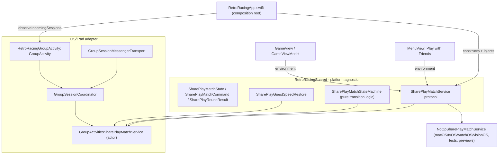

# SharePlay Competitive Mode

## Agent summary

> Narrow tasks may stop here; open the full contract for implementation or review.

- **Scope:** 2-player SharePlay competitive races on iOS/iPad only (v1); host-authoritative start, local simulation with mirrored events, own-score leaderboard submission, dual-retry with 30s timeout, guest speed restore, free-play exception.
- **Must not break:** No `#if os()` in the service layer (platform gating stays in `RetroRacingApp.swift`); `SharePlayMatchStateMachine` stays pure/synchronous with no `GroupActivities` import; SharePlay matches never call `PlayLimitService.recordGamePlayed`; each player still submits their own score via the existing `LeaderboardService.submitScore` path.
- **Key files:** `SharePlay/SharePlayMatchStateMachine.swift`, `Services/Implementations/GroupActivitiesSharePlayMatchService.swift`, `Services/Protocols/SharePlayMatchService.swift`, `Views/GameViewModel+SharePlay.swift`, `Views/SharePlayOverlayView.swift`, `Views/SharePlayResultView.swift`.

## Overview

SharePlay Competitive Mode lets two players race head-to-head over FaceTime's Group Activities
infrastructure. Framing: **"Friend races are free."** — matches are always free and never count
against the daily play limit (see [`monetization.md`](monetization.md), "SharePlay Exception").

**v1 scope:** iOS and iPad only (`RetroRacingUniversal`). macOS/tvOS/watchOS/visionOS use a
no-op fallback and do not expose the entry point.

**Not in scope for v1:** more than 2 players, spectators, cross-round chat, non-Apple-platform
transport.

## Match Lifecycle

1. **Entry**: Either player taps **Play with Friends** in `MenuView` (host), or the system
   activates an incoming SharePlay session for a participant who joined via FaceTime/Messages
   (guest). Both paths converge on the same `SharePlayMatchService.observeIncomingSessions()`
   stream — see Architecture below. On tap, `RetroRacingApp` checks
   `GroupStateObserver.isEligibleForGroupSession`: if the device is already in a FaceTime call,
   `startHostSession()` calls `activate()` directly; otherwise `activate()` cannot present any UI
   on its own, so `prepareHostActivation()` marks host intent and a `GroupActivitySharingController`
   is presented natively via UIKit (`SharePlayActivitySharingPresenter`), letting the person invite
   someone and start the call first. Dismissing the sharing controller without starting a session
   clears only the pending host activation; SwiftUI teardown after a real session starts must not be
   treated as user cancellation.
2. **Waiting** (`.waitingForFriend`): session created/joined; waiting for the second participant.
3. **Countdown** (`.countdown(startAt:difficulty:)`): once both participants are present, the
   **host** starts a synchronized 3-second countdown at the host's currently-selected
   `GameDifficulty`. The guest adopts this difficulty for the match (see Guest Speed Restore).
4. **In round** (`.inRound(difficulty:localScore:remoteScore:remoteLives:)`): each device simulates gameplay
   locally (own `GameScene`) and mirrors score **and remaining lives** updates over the transport.
   There is no shared game state beyond score/lives/elimination events. The scene stays paused
   during `.waitingForFriend` and `.countdown`; gameplay starts only when the state enters
   `.inRound` after the synchronized countdown completes.
5. **Local elimination** (`.waitingAfterLocalLoss(remoteScore:localFinalScore:)`): the first
   player eliminated waits, with a live view of the friend still racing.
6. **Finished** (`.finished(SharePlayRoundResult)`): once both players are eliminated, the
   result — both final scores and the win/lose/tie outcome from each side's perspective — is
   computed and mirrored so both devices show identical results.
7. **Retry handshake** (`.retryWaiting(localReady:remoteReady:deadline:)`): each player taps
   **Play Again** independently; once both confirm, the match resets to `.waitingForFriend` for a
   new round. A 30-second deadline is enforced; if it elapses before both confirm, the state
   becomes `.retryTimedOut`.
8. **Terminal states**: `.retryTimedOut` and `.aborted(reason:)` (disconnect, session ended, or
   retry timeout with no recovery) end the match; the player can leave the session from
   `SharePlayResultView`. SharePlay **Leave**/**Done** and the in-game menu exit must route
   through the same finish path as solo game-over: leave the SharePlay session, notify the other
   device, stop gameplay/audio, reset `shouldStartGame`, create a fresh session ID, and return
   to the menu.

## Architecture



### Shared models and state machine (`RetroRacingShared/SharePlay/`)

- `SharePlayPlayerRole` — `.host` / `.guest`.
- `SharePlayAbortReason` — `.disconnected`, `.retryTimedOut`, `.sessionEnded`.
- `SharePlayMatchState` — drives all UI; `.idle` means no SharePlay match is active (regular
  solo gameplay). `isActive` (`self != .idle`) gates the daily play limit and difficulty lock.
- `SharePlayMatchCommand` — wire messages (`sessionReady`, `roundStart`, `scoreUpdate`,
  `playerEliminated`, `roundResult`, `retryReady`, `sessionFinished`, `sessionAborted`).
  `Codable` + `Sendable` for `GroupSessionMessenger` transport.
- `SharePlayRoundResult` — both players' final scores and difficulty; computes
  `localOutcome(for:)` (won/lost/tie) from either player's perspective.
- `SharePlayMatchStateMachine` — pure, synchronous `(state, command) -> state` plus the retry
  handshake and 30-second timeout. **No `GroupActivities` import** — fully unit-testable in
  isolation from the transport.
- `SharePlayGuestSpeedRestore` — captures the guest's own `GameDifficulty` selection when a
  countdown starts, and restores it on any terminal state (finished/aborted/timed out) so the
  guest's personal preference is unaffected after the match.
- `SharePlayUIState` — bundles `SharePlayMatchState`, `SharePlayPlayerRole`, and optional
  `opponentDisplayName` for atomic propagation from the composition root down to
  `GameView`/`GameViewModel`. Friend names fall back to a localized "Your friend" label when
  GroupActivities does not expose participant display names (iOS 26).

### Service protocol (`Services/Protocols/SharePlayMatchService.swift`)

```swift
public protocol SharePlayMatchService: AnyObject, Sendable {
    func setStateChangeHandler(_ handler: @escaping @Sendable (SharePlayMatchState) -> Void) async
    func currentRole() async -> SharePlayPlayerRole?
    func startHostSession() async
    func prepareHostActivation() async
    func cancelHostActivation() async
    func observeIncomingSessions() async
    func hostStartRoundIfReady(difficulty: GameDifficulty) async
    func updateLocalScore(_ score: Int, lives: Int) async
    func currentOpponentDisplayName() async -> String?
    func reportLocalElimination(finalScore: Int) async
    func retry() async
    func leaveSession() async
}
```

Injected via `SharePlayMatchService+Environment.swift`, matching the existing
`AchievementMetadataService+Environment.swift` DI convention. Views/view models never talk to
`GroupActivities` directly.

### iOS/iPad adapter (`#if canImport(GroupActivities) && os(iOS)`)

- `RetroRacingGroupActivity` — `GroupActivity` conformance; `activityIdentifier`
  `"com.accessibilityUpTo11.RetroRacing.shareplay.competitive"`; localized title
  (`shareplay_activity_title`).
- `GroupSessionCoordinator` — manages a single `GroupSession<RetroRacingGroupActivity>`
  lifecycle: participant readiness, disconnect → abort, and wires
  `GroupSessionMessengerTransport`.
- `GroupSessionMessengerTransport` — thin wrapper around `GroupSessionMessenger` send/receive of
  `SharePlayMatchCommand`.
- `GroupActivitiesSharePlayMatchService` — the production `SharePlayMatchService`, an **actor**
  composing the coordinator, messenger, and `SharePlayMatchStateMachine`. Handles both
  host-activated (`startHostSession()`) and system-activated (`observeIncomingSessions()`)
  sessions identically — both arrive via `RetroRacingGroupActivity.sessions()` and are
  distinguished only by whether `pendingHostActivation` was set first (by `startHostSession()` or
  `prepareHostActivation()`).
- `SharePlayActivitySharingPresenter` — presents the system `GroupActivitySharingController`
  from an invisible UIKit host embedded in the menu background. It intentionally does not use a
  SwiftUI `.fullScreenCover` for the system sharing sheet, because the extra cover can outlive
  the UIKit sheet and leave a blank, non-interactive screen. Each **Play with Friends** tap
  creates a fresh `SharePlaySharingPresentation` identity so re-presenting works after dismiss.
  Used when `GroupStateObserver.isEligibleForGroupSession` is `false`, since `GroupActivity.activate()`
  only works (and only presents system UI) while already in a FaceTime call/Messages
  conversation. `SharePlaySharingPresentation` itself is platform-neutral so non-iOS app targets
  still compile; only the UIKit presenter is iOS-gated.
- `NoOpSharePlayMatchService` — fallback for macOS/tvOS/watchOS/visionOS, previews, and tests;
  every method is a no-op so calling code behaves exactly as before SharePlay existed.

### Composition root (`RetroRacingUniversal/App/RetroRacingApp.swift`)

- Constructs `GroupActivitiesSharePlayMatchService` on iOS, `NoOpSharePlayMatchService`
  elsewhere — the only `#if os(iOS)` branch; the service layer itself stays `#if os()`-free.
- Injects via `.sharePlayMatchService(...)` environment modifier.
- A single long-lived `.task` calls `setStateChangeHandler` (hopping to `@MainActor` before
  touching `@State`) and `observeIncomingSessions()` for the app's lifetime.
- `handleSharePlayStateChanged(_:)` mirrors state into `sharePlayUIState` and — the first time
  the state transitions away from `.idle` while the menu is presented — dismisses the menu and
  starts a game session exactly like tapping **Play**, but without any daily play-limit/paywall
  check. This covers host-initiated and system-activated (incoming) sessions identically.
- **Entitlement**: `com.apple.developer.group-session` (Boolean) added to
  `RetroRacingUniversal.entitlements` via the **Group Activities** Xcode capability.

### Gameplay integration

- `GameView` renders `SharePlayOverlayView` (transient, non-blocking: waiting spinner,
  synchronized numeric countdown, waiting-after-loss, disconnect) **centered on the game
  square**. Overlay cards use the first-party `WaitingForFriendToJoin`, `GetReady`,
  `WaitingForFriendToFinish`, and `ConnectionLost` assets, plus native `glassEffect` on iOS 26
  with material/opaque Reduce Transparency fallbacks. `GameView` presents `SharePlayResultView`
  as a `.sheet` (`.interactiveDismissDisabled(true)`)
  for terminal/handshake states (`.finished`, `.retryWaiting`, `.retryTimedOut`, `.aborted`).
  The result sheet merges match outcome (won/lost/tie + score comparison) with the personal stats
  normally shown on the solo game-over screen (your best score, speed, friend leaderboard rows).
  Solo `GameOverView` is suppressed while SharePlay is active.
- During `.inRound`, the standard HUD header says `Your score` for the local player and shows the
  friend/name score row plus remote lives below it. The fallback friend row uses `Friend score`
  for visual balance. These rows must not include “overtakes” copy. The remote helmet uses
  template rendering tinted with the secondary text style so the friend's lives read as secondary
  HUD information.
- `GameViewModel+SharePlay.swift` bridges match-service calls: `reportSharePlayScoreIfActive`,
  `reportSharePlayEliminationIfActive` (called alongside — not instead of — the existing
  single-player game-over flow in `handleCollision()`), `retrySharePlayMatch`,
  `leaveSharePlayMatch`, and guest speed capture/restore around `applySharePlayState(_:)`.
- Gameplay is pause-locked while waiting for a friend, during countdown, after local loss, during
  retry waiting/timeout, and after disconnect/abort. The scene unlocks only for `.inRound`.
- SharePlay round start uses the countdown “go” cue and starts the scene immediately, bypassing
  the normal solo start cue after the countdown.
- On final collision, the local device sends an ordered `scoreUpdate(score, lives: 0)` before
  `playerEliminated(finalScore:)` so the friend's HUD reliably reaches zero lives without a
  wire-format change.
- Result artwork: wins use `WinWithFriend`, losses use `LoseWithFriend`, retry/waiting uses
  `Rematch`, disconnect/session-ended states use `ConnectionLost`, and ties keep the existing
  neutral symbol until a tie asset is added. Friend-ahead and overtaken-friend rows reuse the
  same avatar row component as `GameOverView`; **Play Again**, **Leave**, and **Done** use the
  same bottom action bar and button font treatment.
- **Leaderboard submission is unchanged**: each player still submits their own score via the
  existing `LeaderboardService.submitScore` path in `handleCollision()`. No leaderboard protocol
  changes.
- **Difficulty lock**: `MenuView` passes `isGameSessionInProgress: isSharePlayActive` into its
  `SettingsView` sheet so difficulty editing is disabled while a match is active (the guest's
  difficulty is host-authoritative for the match's duration).

## Free-Play Exception

See [`monetization.md`](monetization.md#shareplay-exception) for the full monetization
contract. Summary: SharePlay matches are always free, skip `recordGamePlayed`, and the **Play
with Friends** entry point never routes through the paywall/limit check.

## Localization

New keys added to `RetroRacingShared/Localizable.xcstrings` (EN/ES/CA, mirrored to
en-GB/en-AU/en-CA): activity title, waiting/countdown/friend-score overlay strings, result
titles (won/lost/tie), retry handshake and timeout strings, aborted messaging, the **Play with
Friends** button label, visible free footer (`Friend races are free.`), explicit accessibility
hint (`SharePlay matches don’t use daily plays.`), HUD score labels, `Your best`, and the paywall
free-notice copy. SharePlay user-facing copy avoids em dashes and uses friend wording rather than
opponent wording.

## Testing

### Unit tests

- `SharePlayMatchStateMachineTests` — session lifecycle, score/elimination, winner/tie
  computation, retry handshake + 30s timeout, disconnect/session-end.
- `SharePlayGuestSpeedRestoreTests` — capture/restore on normal finish and on abort.
- `SharePlayTwoPeerConvergenceTests` — mocked-transport integration tests that relay commands
  between two independent `SharePlayMatchStateMachine` instances (host + guest), proving both
  peers converge on an identical `.finished` result, dual-retry reset, and `.retryTimedOut`
  without any dependency on `GroupActivities`.
- `GameViewModelTests` (SharePlay free-play exception + lifecycle cases) — SharePlay rounds never
  call `recordGamePlayed`, even at zero remaining daily plays; SharePlay collisions do not present
  solo `GameOverView`; final collision sends `lives: 0` before elimination; waiting/countdown/
  recovery states keep gameplay paused; baseline idle-state behavior is unaffected.
- `GeneratedSFXRecipeTests` — generated countdown step/go recipes render and have expected
  durations; `SharePlayCountdownCueScheduler` plays once per displayed countdown step.

### Manual QA (required before shipping)

2-device SharePlay validation is not automatable and must be run manually before this feature is
considered done:

- Host starts a session from **Play with Friends**; guest joins via the system SharePlay sheet.
- Countdown is synchronized; both devices start the round at the same shared difficulty.
- Countdown uses the generated ascending beep sequence plus final “go” beep; per-second
  VoiceOver countdown announcements are not posted.
- Score mirroring and friend-score HUD update live during the round, including remote lives
  reaching zero before result.
- Elimination order: first-eliminated player sees the waiting screen with separate local and
  friend overtake lines.
- Final result (win/lose/tie + both scores) matches on both devices.
- Dual-retry: both confirm → new round starts; only one confirms and the 30s deadline elapses →
  `.retryTimedOut` recovery UI appears on both devices.
- Disconnect mid-match on either device surfaces `.aborted(.disconnected)` on the other.
- Tapping the in-game menu/close button during a SharePlay match leaves the session and shows the
  other player the connection-lost recovery UI.
- Cancel SharePlay invitation before a session starts; the menu remains usable and no blank
  gameplay screen appears.
- Guest's difficulty preference is restored after the match ends (finished, timed out, or
  aborted).
- Neither player's daily play count is affected, regardless of remaining plays before the match.

## See Also

- [`monetization.md`](monetization.md) — SharePlay Exception (free-play framing).
- [`launch_flow.md`](launch_flow.md) — Play with Friends entry point in the menu flow.
- [`accessibility.md`](accessibility.md) — VoiceOver behavior for SharePlay overlays.
- [`testing.md`](testing.md) — SharePlay test coverage.

---

**Last updated**: 2026-07-22 (SharePlay UX polish: embedded sharing presenter, first-party overlay art, friend wording, menu-exit cancellation)
