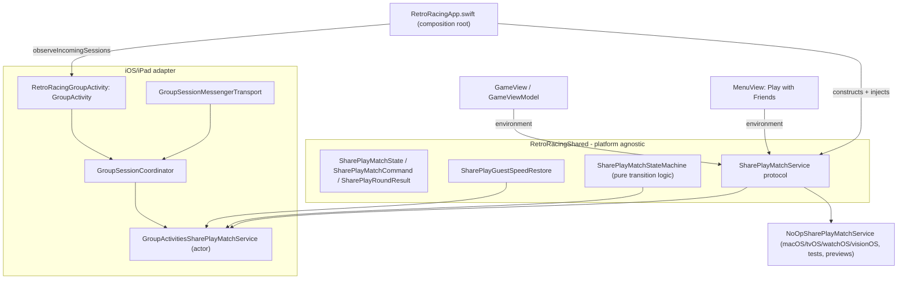

# SharePlay Competitive Mode

## Agent summary

> Narrow tasks may stop here; open the full contract for implementation or review.

- **Scope:** 2-player SharePlay competitive races on iOS/iPad only (v1); host-authoritative start, local simulation with mirrored events, own-score leaderboard submission, dual-retry with 30s timeout, guest speed restore, free-play exception.
- **Must not break:** No `#if os()` in the shared service layer (platform gating stays in the app composition/adapter layer); `SharePlayMatchStateMachine` stays pure/synchronous with no `GroupActivities` import; SharePlay matches never call `PlayLimitService.recordGamePlayed`; each player still submits their own score via the existing `LeaderboardService.submitScore` path.
- **Key files:** `RetroRacingShared/SharePlay/SharePlayMatchStateMachine.swift`, `RetroRacingUniversal/SharePlay/GroupActivitiesSharePlayMatchService.swift`, `RetroRacingShared/Services/Protocols/SharePlayMatchService.swift`, `RetroRacingShared/Views/GameViewModel+SharePlay.swift`, `RetroRacingShared/Views/SharePlayOverlayView.swift`, `RetroRacingShared/Views/SharePlayResultView.swift`.

## Overview

SharePlay Competitive Mode lets two players race head-to-head over FaceTime's Group Activities
infrastructure. Framing: **"Friend races are free."** — matches are always free and never count
against the daily play limit (see [`monetization.md`](monetization.md), "SharePlay Exception").
For a plain-English architecture map, see
[`TechDocs/play-with-friends-shareplay.md`](../TechDocs/play-with-friends-shareplay.md).

**v1 scope:** iOS and iPad only (`RetroRacingUniversal`). macOS/tvOS/watchOS/visionOS use a
no-op fallback and do not expose the entry point.

**Not in scope for v1:** more than 2 players, spectators, cross-round chat, non-Apple-platform
transport.

## Match Lifecycle

1. **Entry**: Either player taps **Play with Friends** in `MenuView` to start a host flow, or the
   system activates an incoming SharePlay session for a participant who joined via FaceTime/Messages
   (guest). Both paths converge on the same `SharePlayMatchService.observeIncomingSessions()`
   stream — see Architecture below. On iOS/iPad, menu-started host flows follow
   `GroupStateObserver.isEligibleForGroupSession`: an eligible FaceTime/Messages conversation
   activates the prepared activity directly, while an ineligible device presents the native
   `GroupActivitySharingController` through `SharePlayActivitySharingPresenter` so the player can
   choose people first. This prevents an eligible conversation from being routed through another
   sharing controller and showing a replacement prompt.
   The menu button keeps its normal **Play with Friends** presentation; it is not the waiting UI.
   `GroupActivitySharingController` owns starting the activity and joining the initiating app.
   Sharing-controller success is an in-progress handoff only, not a live match. The app first gives
   the controller-created session a settle window. If no session arrives and the newly-created
   conversation becomes eligible, the same pending request performs one guarded direct activation
   automatically rather than requiring another button tap or presenting a replacement controller.
   The app enters gameplay only after the session delivered through `sessions()` reaches
   `GroupSession.State.joined`. A provisional session that invalidates while still waiting is
   discarded without publishing `.waitingForFriend` or `.aborted` to the UI.
   Host activation is idempotent: repeated taps while an activation is pending or a session is
   active are ignored. Dismissing the sharing controller without starting a session clears only the
   pending host activation; SwiftUI teardown after a real session starts must not be treated as
   user cancellation. Role assignment comes from `GroupSession.isLocallyInitiated`, not from the
   pending activation flag, so an invited participant who joins from the system SharePlay prompt
   stays guest. The service and composition root keep the outgoing host request pending until the
   delivered session reaches `.joined`, the controller is cancelled, or the handoff times out;
   repeated menu taps during that interval cannot present another sharing/replacement flow.
2. **Waiting** (`.waitingForFriend`): session created/joined; waiting for the second participant.
3. **Countdown** (`.countdown(startAt:difficulty:)`): once both participants are present, the
   **host** starts a synchronized 3-second countdown at the host's currently-selected
   `GameDifficulty`. The guest adopts this difficulty for the match (see Guest Speed Restore).
4. **In round** (`.inRound(difficulty:localScore:remoteScore:remoteLives:)`): each device simulates gameplay
   locally (own `GameScene`) and mirrors score **and remaining lives** updates over the transport.
   There is no shared game state beyond score/lives/elimination events. The scene stays paused
   during `.waitingForFriend` and `.countdown`; gameplay starts only when the state enters
   `.inRound` after the synchronized countdown completes.
5. **Local elimination** (`.waitingAfterLocalLoss(remoteScore:localFinalScore:)`): the first
   player eliminated waits, with a live view of the friend still racing.
6. **Finished** (`.finished(SharePlayRoundResult)`): once both players are eliminated, the
   result — both final scores and the win/lose/tie outcome from each side's perspective — is
   computed and mirrored so both devices show identical results.
7. **Retry handshake** (`.retryWaiting(localReady:remoteReady:deadline:)`): each player taps
   **Play Again** independently; once both confirm, the match resets to `.waitingForFriend` for a
   new round. A 30-second deadline is enforced; if it elapses before both confirm, the state
   becomes `.retryTimedOut`.
8. **Terminal states**: `.retryTimedOut` and `.aborted(reason:)` (disconnect, session ended, or
   retry timeout with no recovery) end the match; the player can leave the session from
   `SharePlayResultView`. SharePlay **Leave**/**Done** and the in-game menu exit must route
   through the same finish path as solo game-over: leave the SharePlay session, notify the other
   device, stop gameplay/audio, reset `shouldStartGame`, create a fresh session ID, and return
   to the menu.

## Architecture


```mermaid
flowchart TB
    subgraph shared [RetroRacingShared - platform agnostic]
        Models["SharePlayMatchState / SharePlayMatchCommand / SharePlayRoundResult"]
        StateMachine["SharePlayMatchStateMachine (pure transition logic)"]
        Protocol["SharePlayMatchService protocol"]
        GuestSpeed["SharePlayGuestSpeedRestore"]
    end
    subgraph adapter [iOS/iPad adapter]
        GroupActivity["RetroRacingGroupActivity: GroupActivity"]
        Coordinator["GroupSessionCoordinator"]
        Messenger["GroupSessionMessengerTransport"]
        Impl["GroupActivitiesSharePlayMatchService (actor)"]
    end
    NoOp["NoOpSharePlayMatchService (macOS/tvOS/watchOS/visionOS, tests, previews)"]

    Protocol --> Impl
    Protocol --> NoOp
    StateMachine --> Impl
    GuestSpeed --> Impl
    Coordinator --> Impl
    Messenger --> Coordinator
    GroupActivity --> Coordinator

    App["RetroRacingApp.swift (composition root)"] -->|constructs + injects| Protocol
    App -->|observeIncomingSessions| GroupActivity
    Menu["MenuView: Play with Friends"] -->|environment| Protocol
    GameView["GameView / GameViewModel"] -->|environment| Protocol
```

### Shared models and state machine (`RetroRacingShared/SharePlay/`)

- `SharePlayPlayerRole` — `.host` / `.guest`.
- `SharePlayAbortReason` — `.disconnected`, `.retryTimedOut`, `.sessionEnded`.
- `SharePlayMatchState` — drives all UI; `.idle` means no SharePlay match is active (regular
  solo gameplay). `isActive` (`self != .idle`) gates the daily play limit and difficulty lock.
- `SharePlayMatchCommand` — wire messages (`sessionReady`, `roundStart`, `scoreUpdate`,
  `playerEliminated`, `roundResult`, `retryReady`, `sessionFinished`, `sessionAborted`).
  `Codable` + `Sendable` for `GroupSessionMessenger` transport.
- `SharePlayRoundResult` — both players' final scores and difficulty; computes
  `localOutcome(for:)` (won/lost/tie) from either player's perspective.
- `SharePlayMatchStateMachine` — pure, synchronous `(state, command) -> state` plus the retry
  handshake and 30-second timeout. **No `GroupActivities` import** — fully unit-testable in
  isolation from the transport.
- `SharePlayGuestSpeedRestore` — captures the guest's own `GameDifficulty` selection when a
  countdown starts, and restores it on any terminal state (finished/aborted/timed out) so the
  guest's personal preference is unaffected after the match.
- `SharePlayUIState` — bundles `SharePlayMatchState`, `SharePlayPlayerRole`, and optional
  `opponentDisplayName` for atomic propagation from the composition root down to
  `GameView`/`GameViewModel`. HUD/result score rows use the friend's display name when available
  and fall back to a localized `Friend` label when GroupActivities does not expose participant
  display names (iOS 26).
- `SharePlayParticipantCountPolicy` — pure participant-count classification used by the iOS
  coordinator: waiting before ready, exactly-two ready/already-ready, unsupported more than two,
  loss after ready, and ignored intentional teardown.

### Service protocol (`Services/Protocols/SharePlayMatchService.swift`)

```swift
public protocol SharePlayMatchService: AnyObject, Sendable {
    func setStateChangeHandler(
        _ handler: @escaping @Sendable (SharePlayUIState) async -> Void
    ) async
    func prepareHostActivation() async -> Bool
    func activatePendingHostSession(reason: SharePlayHostActivationReason) async -> Bool
    func cancelHostActivation(reason: SharePlayHostActivationReason) async
    func observeIncomingSessions() async
    func hostStartRoundIfReady(difficulty: GameDifficulty) async
    func updateLocalScore(_ score: Int, lives: Int) async
    func reportLocalElimination(finalScore: Int) async
    func retry() async
    func leaveSession() async
}
```

Injected via `SharePlayMatchService+Environment.swift`, matching the existing
`AchievementMetadataService+Environment.swift` DI convention. Views/view models never talk to
`GroupActivities` directly.

### iOS/iPad adapter (`RetroRacingUniversal/SharePlay`, `#if canImport(GroupActivities) && os(iOS)`)

- `RetroRacingGroupActivity` — `GroupActivity` conformance; `activityIdentifier`
  `"com.accessibilityUpTo11.RetroRacing.shareplay.competitive"`; localized title
  (`shareplay_activity_title`), free-race subtitle, and associated-domain fallback URL for system
  invite handoff.
- `GroupSessionCoordinator` — actor-isolated owner of a single
  `GroupSession<RetroRacingGroupActivity>` lifecycle: participant readiness, disconnect → abort,
  and wires
  `GroupSessionMessengerTransport`. Participant-ready and display-name callbacks are
  edge-triggered so repeated `activeParticipants` emissions do not re-start no-op host checks or
  invalidate SwiftUI without a visible state change. Stale observer callbacks and messenger
  commands from prior sessions are ignored by session generation. Participant readiness requires
  exactly two active participants; three or more active participants abort locally because v1 has
  only one remote score/lives slot. Participant-count loss after readiness uses a short grace window
  so transient GroupActivities join churn does not flash a false connection-lost screen. A
  pre-ready session invalidation is also deferred briefly and cancelled by a replacement session,
  because the system can invalidate the first guest session immediately before delivering the
  real joined session. A delivered session is not admitted to app navigation until its state reaches
  `.joined`; invalidation before that edge is treated as transport setup churn, not a user-visible
  disconnect.
- `GroupSessionMessengerTransport` — thin wrapper around `GroupSessionMessenger` send/receive of
  `SharePlayMatchCommand`.
- `GroupActivitiesSharePlayMatchService` — the production `SharePlayMatchService`, an **actor**
  composing the coordinator, host activation controller, state notifier, timer controller, and
  `SharePlayMatchStateMachine`. Handles both
  menu-started host sessions and system-activated incoming sessions identically — both arrive via
  `RetroRacingGroupActivity.sessions()` and assign role from `GroupSession.isLocallyInitiated`,
  while pending host activation only gates duplicate activation attempts. SharePlay
  service/coordinator/app-state boundaries emit structured
  `SHAREPLAY_*` logs for session observation, participant counts, delayed disconnect scheduling
  and cancellation, incoming lifecycle commands, and UI state propagation so transient terminal
  flashes can be diagnosed from a two-device log capture without exposing player names.
  The service applies `SharePlaySessionAdmissionPolicy`: active match states remain quarantined
  until the coordinator reports `.joined`, and a pre-join invalidation is discarded instead of
  becoming `.aborted`.
  After the participant-ready edge, the service re-sends the idempotent local `.sessionReady`
  command because the first ready message may have been emitted before the remote peer joined the
  transport.
- `GroupActivitiesSharePlayHostActivationController` — internal iOS helper owned by the service
  actor; owns pending/in-flight host activation state, direct `RetroRacingGroupActivity.activate()`
  calls, cancellation, and activation logging.
- `SharePlayStateNotifier` — internal iOS helper owned by the service actor; owns state-change
  handler storage, notification admission, last-notified state caching, and UI-state notification
  logging.
- `SharePlayMatchTimerController` — internal iOS helper owned by the service actor; owns countdown
  and retry timeout `Task` scheduling/cancellation. Timer callbacks re-enter the service actor,
  which still owns match state transitions and command emission.
- `SharePlayActivitySharingPresenter` — presents the system `GroupActivitySharingController`
  from an invisible UIKit host embedded in the menu background. It intentionally does not use a
  SwiftUI `.fullScreenCover` for the system sharing sheet, because the extra cover can outlive
  the UIKit sheet and leave a blank, non-interactive screen. Each **Play with Friends** tap
  creates a fresh `SharePlaySharingPresentation` identity, and the hidden UIKit host is keyed and
  reset from that identity so re-presenting works after dismiss. The iOS/iPad menu uses this system
  sharing UI only when `GroupStateObserver` reports that no group conversation is eligible;
  eligible requests activate directly and therefore cannot present a replacement-controller alert.
  Dismissal is classified from `GroupActivitySharingController.result`: `.cancelled` clears pending
  host activation as user cancellation, while `.success` marks an invite handoff. The controller
  normally starts and joins the activity. If no session is delivered after a short settle period
  and the controller-created conversation is now eligible, the composition root asks the service
  to perform one idempotent direct-activation recovery.
  `SharePlaySharingPresentation` itself is platform-neutral so non-iOS app targets still compile;
  only the UIKit presenter is iOS-gated.
- `NoOpSharePlayMatchService` — fallback for macOS/tvOS/watchOS/visionOS, previews, and tests;
  every method is a no-op so calling code behaves exactly as before SharePlay existed.

### Composition root (`RetroRacingUniversal/App/RetroRacingApp.swift`)

- Constructs `GroupActivitiesSharePlayMatchService` on iOS, `NoOpSharePlayMatchService`
  elsewhere — the only `#if os(iOS)` branch; the service layer itself stays `#if os()`-free.
- Injects via `.sharePlayMatchService(...)` environment modifier.
- A single long-lived `.task` calls `setStateChangeHandler` (hopping to `@MainActor` before
  touching `@State`) and `observeIncomingSessions()` for the app's lifetime. The handler receives
  an atomic `SharePlayUIState` snapshot from the service, so state, role, and display-name updates
  cannot be stitched together from separate actor calls.
- `handleSharePlayStateChanged(_:)` mirrors service state into `sharePlayUIState`. The first real
  session transition away from `.idle` starts a game session exactly like tapping **Play**, but
  without any daily play-limit/paywall check.
- `SharePlayActivationHandoffCoordinator` owns a short-lived activation request ID. The menu
  button stays visually stable while duplicate taps are ignored internally. Eligible conversations
  call `activatePendingHostSession(reason:)`; ineligible devices present the sharing controller. If
  the sharing controller is dismissed, the pending host activation is cancelled and the menu remains
  usable. If it succeeds, the app logs `SHAREPLAY_INVITE_HANDOFF`, removes the completed presenter,
  and awaits the system-delivered session. A controller handoff that becomes eligible but delivers
  no session gets one delayed direct-activation recovery. The request is cleared only when that
  session reaches `.joined`, activation fails, or the bounded handoff timeout expires. Activation
  and cancellation reasons use `SharePlayHostActivationReason` so log/control reasons stay stable.
- **Entitlement**: `com.apple.developer.group-session` (Boolean) added to
  `RetroRacingUniversal.entitlements` via the **Group Activities** Xcode capability.

### Gameplay integration

- `GameView` renders `SharePlayOverlayView` (transient, non-blocking: waiting spinner,
  synchronized numeric countdown, waiting-after-loss, disconnect) **centered on the game
  square**. Overlay cards use the first-party `WaitingForFriendToJoin`, `GetReady`,
  `WaitingForFriendToFinish`, and `ConnectionLost` assets, plus native `glassEffect` on iOS 26
  applied directly to the padded card content. Material/color backgrounds are reserved for
  pre-iOS 26 and Reduce Transparency fallbacks. `GameView` presents `SharePlayResultView`
  as a `.sheet` (`.interactiveDismissDisabled(true)`)
  for terminal/handshake states (`.finished`, `.retryWaiting`, `.retryTimedOut`, `.aborted`).
  The result sheet merges match outcome (won/lost/tie + score comparison) with the personal stats
  normally shown on the solo game-over screen (your best score, speed, friend leaderboard rows).
  SharePlay friend leaderboard rows are captured as a stable per-result snapshot so late in-race
  friend milestone refreshes cannot briefly show then remove stale social rows.
  Solo `GameOverView` is suppressed while SharePlay is active. After the local player taps
  **Play Again** from a finished match, the sheet immediately renders retry/waiting content while
  the ordered retry command propagates, so stale win/loss content does not flash during restart.
- During `.inRound`, the standard HUD header uses concise score rows (`You: <score>` and
  `<friend name>: <score>` when available, otherwise `Friend: <score>`) plus remote lives below it.
  These rows must not include “overtakes” copy. The remote helmet uses the
  original helmet art with desaturation, reduced contrast, and opacity so the friend's lives read
  as secondary HUD information while preserving the helmet detail.
- `GameViewModel+SharePlay.swift` bridges match-service calls: `reportSharePlayScoreIfActive`,
  `reportSharePlayEliminationIfActive` (called alongside — not instead of — the existing
  single-player game-over flow in `handleCollision()`), `retrySharePlayMatch`,
  `leaveSharePlayMatch`, and guest speed capture/restore around `applySharePlayState(_:)`.
- The host auto-starts countdown only after both conditions are true: the GroupActivities session
  reports two active participants, and the remote peer's ordered `.sessionReady` command has been
  received by the state machine. Each peer sends `.sessionReady` when it joins and re-sends it when
  the session first reports two active participants; the message is idempotent and prevents a
  dropped/too-early ready command from deadlocking both players at **Waiting for your friend**.
- Gameplay is pause-locked while waiting for a friend, during countdown, after local loss, during
  retry waiting/timeout, and after disconnect/abort. The scene unlocks only for `.inRound`.
- SharePlay round start uses the countdown “go” cue and starts the scene immediately, bypassing
  the normal solo start cue after the countdown.
- On final collision, the local device sends an ordered `scoreUpdate(score, lives: 0)` before
  `playerEliminated(finalScore:)` so the friend's HUD reliably reaches zero lives without a
  wire-format change. `reportLocalElimination(finalScore:)` owns that invariant internally
  instead of accepting caller-provided lives.
- Result artwork: wins use `WinWithFriend`, losses use `LoseWithFriend`, ties use `Tie`,
  retry/waiting uses `Rematch`, and disconnect/session-ended states use `ConnectionLost`.
  Friend-ahead and overtaken-friend rows reuse the
  same avatar row component as `GameOverView`; **Play Again**, **Leave**, and **Done** use the
  same bottom action bar and button font treatment.
- Retry timeout is terminal: `SharePlayResultView` must offer **Leave** only for
  `.retryTimedOut`, not **Play Again**, because the retry state machine no longer accepts retry
  input after the 30-second deadline has elapsed. When one device's retry timer fires, it sends
  `.sessionAborted(reason: .retryTimedOut)` so the other device converges to `.retryTimedOut` even
  if its local timer is delayed or suspended.
- **Leaderboard submission is unchanged**: each player still submits their own score via the
  existing `LeaderboardService.submitScore` path in `handleCollision()`. No leaderboard protocol
  changes.
- **Difficulty lock**: `MenuView` passes `isGameSessionInProgress: isSharePlayActive` into its
  `SettingsView` sheet so difficulty editing is disabled while a match is active (the guest's
  difficulty is host-authoritative for the match's duration).

## Free-Play Exception

See [`monetization.md`](monetization.md#shareplay-exception) for the full monetization
contract. Summary: SharePlay matches are always free, skip `recordGamePlayed`, and the **Play
with Friends** entry point never routes through the paywall/limit check.

## Localization

New keys added to `RetroRacingShared/Localizable.xcstrings` (EN/ES/CA, mirrored to
en-GB/en-AU/en-CA): activity title, waiting/countdown/friend-score overlay strings, result
titles (won/lost/tie), retry handshake and timeout strings, aborted messaging, the **Play with
Friends** button label, visible free footer (`Friend races are free.`), explicit accessibility
hint (`SharePlay matches don’t use daily plays.`), HUD score labels, `Your best`, and the paywall
free-notice copy. SharePlay user-facing copy avoids em dashes and uses friend wording rather than
opponent wording.

## Testing

### Unit tests

- `SharePlayMatchStateMachineTests` — session lifecycle, score/elimination, winner/tie
  computation, retry handshake + 30s timeout, disconnect/session-end.
- `SharePlayGuestSpeedRestoreTests` — capture/restore on normal finish and on abort.
- `SharePlayTwoPeerConvergenceTests` — mocked-transport integration tests that relay commands
  between two independent `SharePlayMatchStateMachine` instances (host + guest), proving both
  peers converge on an identical `.finished` result, dual-retry reset, and `.retryTimedOut`
  without any dependency on `GroupActivities`.
- `GameViewModelTests` (SharePlay free-play exception + lifecycle cases) — SharePlay rounds never
  call `recordGamePlayed`, even at zero remaining daily plays; SharePlay collisions do not present
  solo `GameOverView`; final collision sends `lives: 0` before elimination; waiting/countdown/
  recovery states keep gameplay paused; baseline idle-state behavior is unaffected.
- `SharePlayPreReadyInvalidationGraceTests` — deferred pre-ready session invalidation grace:
  cancel-before-fire, reschedule-after-cancel, and should-disconnect guard behavior used by
  `GroupSessionCoordinator`.
- `SharePlaySessionAdmissionPolicyTests` — provisional sessions cannot publish waiting/aborted
  states before `.joined`; pre-join invalidation is discarded while post-join invalidation aborts.
- `SharePlayHostActivationRoutingPolicyTests` — eligible conversations activate directly,
  ineligible devices present the sharing controller, and controller recovery is allowed only once
  for the current eligible request.
- `SharePlayActivationHandoffCoordinatorTests` — duplicate request ignore, direct activation,
  sharing-controller presentation, one recovery activation, user dismissal cancellation,
  incoming-state cleanup, and handoff timeout cancellation.
- `SharePlayHostActivationReasonTests` — stable raw values for typed host activation and
  cancellation reasons.
- `GeneratedSFXRecipeTests` — generated countdown step/go recipes render and have expected
  durations; `SharePlayCountdownCueScheduler` plays once per displayed countdown step.

### Manual QA (required before shipping)

2-device SharePlay validation is not automatable and must be run manually before this feature is
considered done:

- Host starts a session from **Play with Friends**; guest joins via the system SharePlay sheet.
- Countdown is synchronized; both devices start the round at the same shared difficulty.
- Countdown uses the generated ascending beep sequence plus final “go” beep; per-second
  VoiceOver countdown announcements are not posted.
- Score mirroring and friend-score HUD update live during the round, including remote lives
  reaching zero before result.
- Elimination order: first-eliminated player sees the waiting screen with separate local and
  friend overtake lines.
- Final result (win/lose/tie + both scores) matches on both devices.
- Dual-retry: both confirm → new round starts without stale win/loss content flashing; only one
  confirms and the 30s deadline elapses → `.retryTimedOut` recovery UI appears on both devices.
- Disconnect mid-match on either device surfaces `.aborted(.disconnected)` on the other.
- Tapping the in-game menu/close button during a SharePlay match leaves the session and shows the
  other player the connection-lost recovery UI.
- Cancel SharePlay invitation before a session starts; the menu remains usable, tapping
  **Play with Friends** again presents a fresh sharing sheet, and no blank gameplay screen appears.
- Guest joins from Messages/FaceTime and taps **Play with Friends** while the system-delivered
  session is pending; the app must join or wait for the incoming session without presenting a
  system **Replace Existing** prompt or misclassifying the guest as host.
- A third active participant joins the activity; v1 must fail safely instead of corrupting the
  two-player score/lives model.
- Guest's difficulty preference is restored after the match ends (finished, timed out, or
  aborted).
- Neither player's daily play count is affected, regardless of remaining plays before the match.

## See Also

- [`monetization.md`](monetization.md) — SharePlay Exception (free-play framing).
- [`launch_flow.md`](launch_flow.md) — Play with Friends entry point in the menu flow.
- [`accessibility.md`](accessibility.md) — VoiceOver behavior for SharePlay overlays.
- [`testing.md`](testing.md) — SharePlay test coverage.
- [`../TechDocs/play-with-friends-shareplay.md`](../TechDocs/play-with-friends-shareplay.md) —
  plain-English SharePlay architecture and flow diagrams.

### External References

- [Presenting SharePlay activities from your app's UI](https://developer.apple.com/documentation/groupactivities/promoting-shareplay-activities-from-your-apps-ui) — canonical start/share UI behavior.
- [Joining and managing a shared activity](https://developer.apple.com/documentation/groupactivities/joining-and-managing-a-shared-activity) — canonical `sessions()`/`join()` lifecycle.
- [Setting up SharePlay on an iOS app](https://www.polpiella.dev/setting-up-shareplay-on-an-ios-app-from-scratch/) — practical custom-data setup and sharing-controller wrapper notes.
- [SharePlay Tutorial: Share custom data between iOS and macOS](https://mitemmetim.medium.com/shareplay-tutorial-share-custom-data-between-ios-and-macos-a50bfecf6e64) — cross-platform custom-data pitfalls; revisit before macOS expansion.
- [Using SharePlay to create a custom shared experience over FaceTime](https://wwdcbysundell.com/2021/using-shareplay-to-create-a-custom-shared-experience/) — concise custom `GroupActivity`, `GroupSessionMessenger`, and message-rate guidance.
- [Supporting coordinated media playback](https://developer.apple.com/documentation/avfoundation/supporting-coordinated-media-playback) — AVFoundation media-sync sample; mostly non-goal for SpriteKit gameplay but useful for session coordination examples.

---

**Last updated**: 2026-08-01 (SharePlay object boundary refactor)
