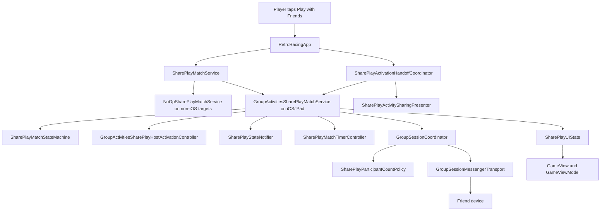
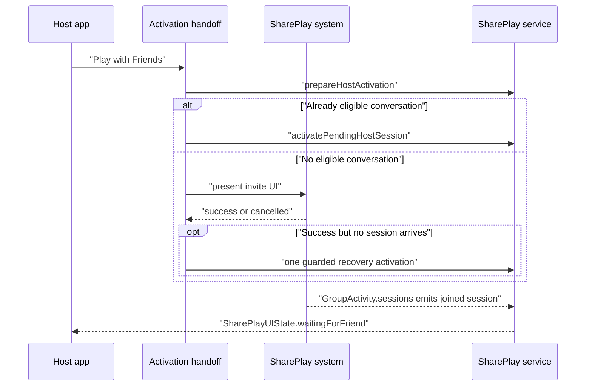
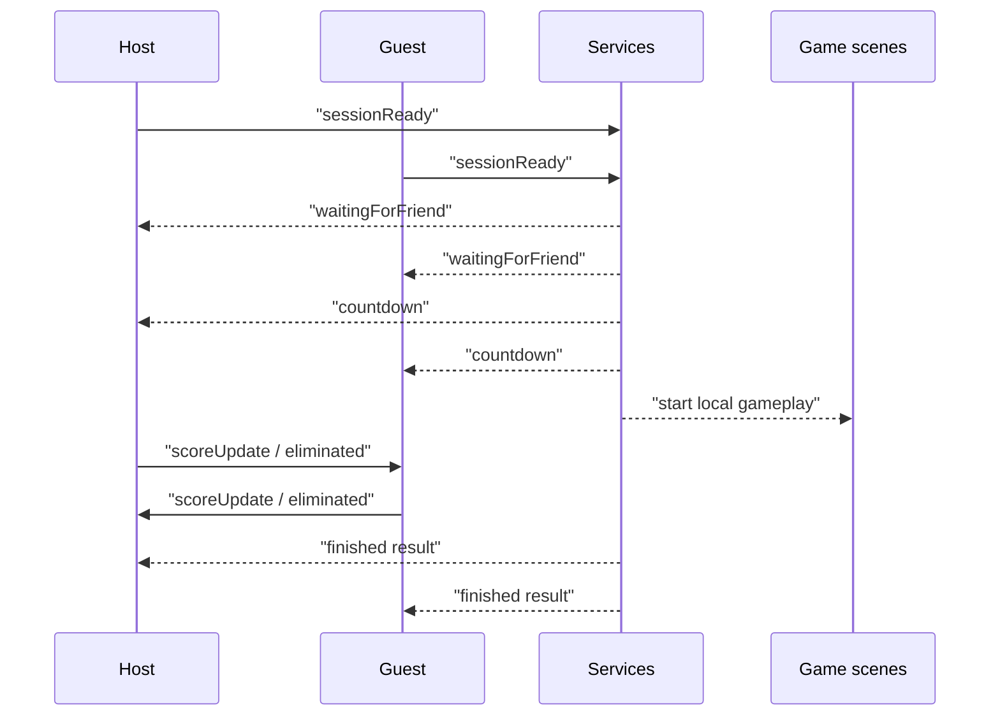
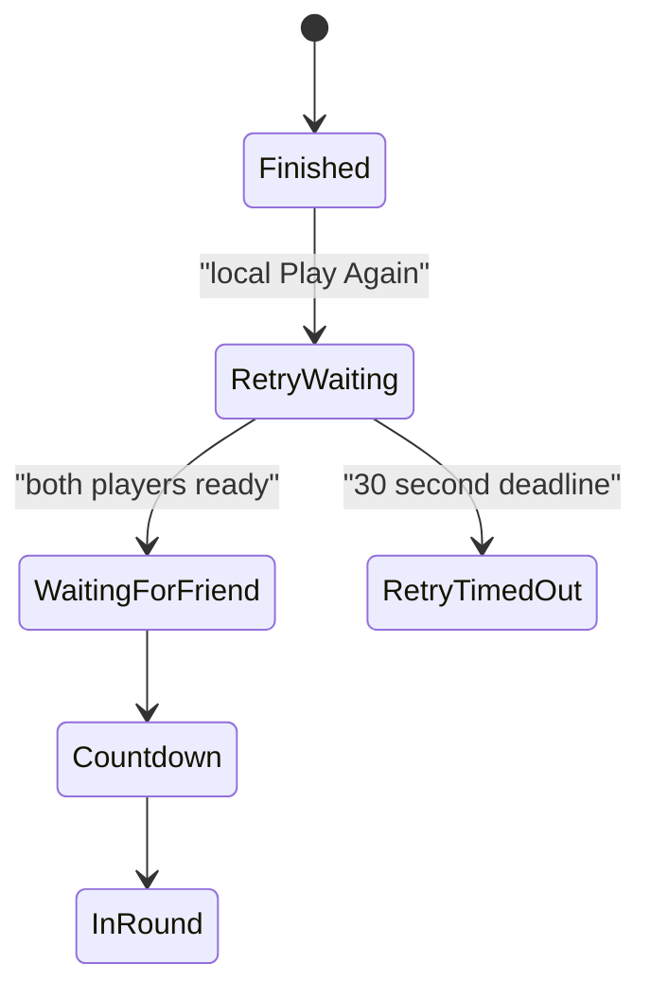
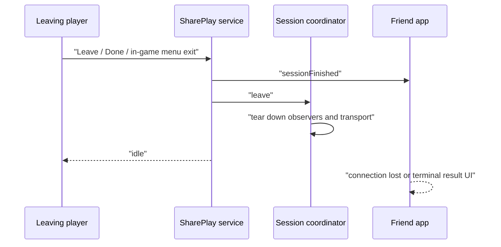

# Play with Friends SharePlay

Play with Friends lets two people start a free head-to-head race through Apple's SharePlay system. Each device runs its own local game, then sends compact match events such as "ready", "score changed", "eliminated", "play again", and "left session" to the other player.

For the detailed shipping contract, see [Requirements/shareplay_multiplayer.md](../Requirements/shareplay_multiplayer.md).

## Object Map

## Main Responsibilities

- `RetroRacingApp` builds the dependencies, injects the SharePlay service, observes incoming SharePlay sessions for the app lifetime, and moves the app from menu to game only after a real SharePlay state arrives.
- `SharePlayActivationHandoffCoordinator` owns the menu-to-system handoff. It ignores duplicate taps, chooses direct activation or the sharing controller, handles user dismissal, and cancels stale pending requests.
- `SharePlayActivitySharingPresenter` presents Apple's native invite UI from the menu on iOS/iPad when there is no eligible group conversation yet.
- `GroupActivitiesSharePlayMatchService` is the production service actor. It owns the match state machine and session runtime state, and delegates local activation, UI notification caching, and timer tasks to small same-actor collaborators.
- `GroupActivitiesSharePlayHostActivationController` owns pending/in-flight host activation, direct activation calls, cancellation, and activation logs.
- `SharePlayStateNotifier` owns UI-state admission checks, the last-notified state cache, and state-change handler dispatch.
- `SharePlayMatchTimerController` owns countdown and retry timeout task scheduling; the service actor still performs the state transition when a timer fires.
- `GroupSessionCoordinator` is the production session actor. It owns the current `GroupSession`, participant observation, display-name updates, messenger transport, and disconnect grace periods.
- `SharePlayParticipantCountPolicy` is pure shared logic that classifies participant count changes before the coordinator performs transport side effects.
- `SharePlayMatchStateMachine` is shared, pure Swift logic. It does not import GroupActivities, so match rules stay unit-testable.
- `GameViewModel` reacts to `SharePlayUIState`, pauses/unpauses gameplay, reports local scores and eliminations, and handles retry/leave actions.

## Invite Flow

The button stays visually stable during this flow. Pending activation is internal state, so repeated taps cannot open multiple invite sheets or create replacement prompts.

## Round Flow

The host chooses the difficulty for the round. The guest temporarily adopts it and restores their own selected difficulty when the match reaches a terminal state.

## Rematch Flow

Retry is a handshake. One player tapping Play Again is not enough; both players must confirm before the next round starts.

## Leave Flow

Leaving routes through the same cleanup path as the rest of the game: gameplay stops, audio state is reset, the local app returns to the menu, and the other device is notified.

## What To Keep Stable

- Keep GroupActivities imports inside the iOS/iPad adapter layer.
- Keep one production SharePlay service actor and one coordinator actor.
- Keep the command wire format stable unless the requirement contract is intentionally changed.
- Keep activation idempotent: duplicate taps, stale handoffs, and timeouts must clear or no-op predictably.
- Keep manual two-device QA as the final release gate, because the real SharePlay transport and system invite UI cannot be fully automated.
